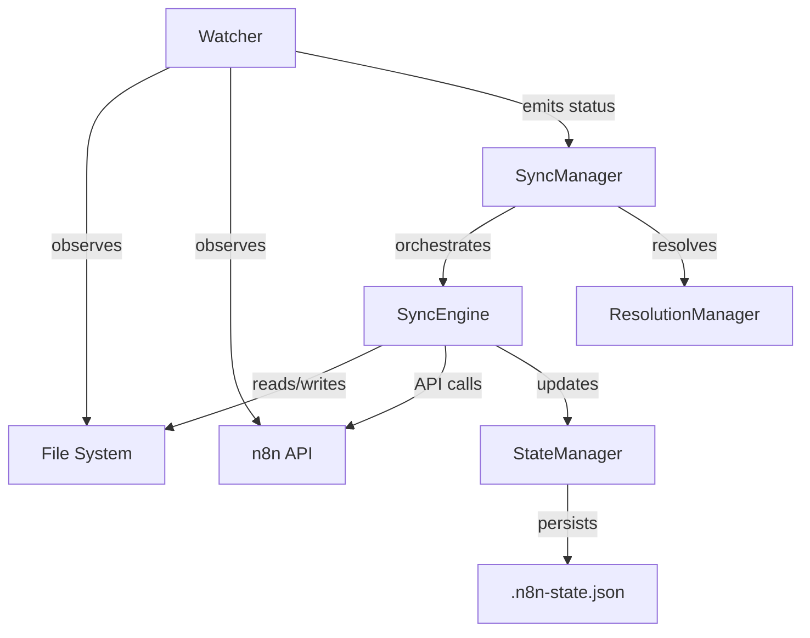
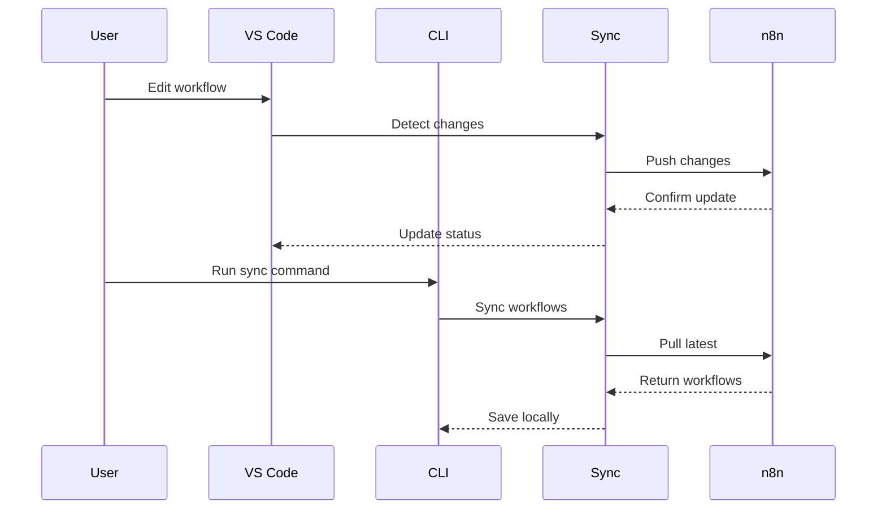

# Architecture Overview

n8n-as-code is a monorepo built with a modular architecture that separates concerns while maintaining tight integration between components.

## 🏗️ Monorepo Structure

```
n8n-as-code/
├── packages/
│   ├── sync/           # Sync library (shared logic)
│   ├── cli/            # Command-line interface
│   ├── skills/      # AI agent integration
│   └── vscode-extension/ # VS Code extension
├── docs/               # Documentation (Docusaurus)
├── scripts/            # Build and utility scripts
└── plans/              # Architecture planning documents
```

## 📦 Package Dependencies

```mermaid
graph TD
    A[VS Code Extension] --> B[Sync Library]
    C[CLI] --> B
    D[Skills CLI] --> B
    B --> E[n8n API]
    
    style A fill:#ff6b35
    style C fill:#ff6b35
    style D fill:#ff6b35
    style B fill:#2c3e50
```



### Dependency Flow
1. **Sync Library** (`@n8n-as-code/sync`): Shared business logic
2. **CLI** (`@n8n-as-code/cli`): Command-line interface using Sync
3. **VS Code Extension**: Visual interface using Sync
4. **Skills CLI** (`@n8n-as-code/skills`): AI integration using Sync

## 🧩 Sync Library Architecture

### 3-Way Merge Architecture

The sync library implements a **3-way merge architecture** that cleanly separates state observation from state mutation:



### Key Principles

1. **Separation of Concerns**: Watcher observes, SyncEngine mutates
2. **3-Way Comparison**: Uses base-local-remote to detect conflicts
3. **Deterministic Detection**: Only flags conflicts when both sides changed
4. **State Persistence**: `.n8n-state.json` tracks last synced state (base)

### Service Layer

```typescript
// Sync services architecture
classDiagram
    class Watcher {
        +startWatching()
        +stopWatching()
        +scanLocalFiles()
        +pollRemoteWorkflows()
        -detectChanges()
    }
    
    class SyncEngine {
        +push(workflow)
        +pull(workflow)
        +delete(workflow)
        +finalizeSync(workflow)
    }
    
    class ResolutionManager {
        +promptForConflict()
        +promptForDeletion()
        +resolveConflict()
    }
    
    class SyncManager {
        +refreshState()
        +syncUp()
        +syncDown()
        +startWatching()
    }
    
    class StateManager {
        +loadState()
        +saveState()
        +updateWorkflowState()
    }
    
    class N8nApiClient {
        +getWorkflows()
        +getWorkflow()
        +updateWorkflow()
        +createWorkflow()
    }
    
    class WorkflowSanitizer {
        +sanitize()
        +validate()
        +sortNodes()
    }
    
    SyncManager --> Watcher
    SyncManager --> SyncEngine
    SyncManager --> ResolutionManager
    SyncEngine --> StateManager
    SyncEngine --> N8nApiClient
    SyncEngine --> WorkflowSanitizer
    Watcher --> StateManager
```

### Key Components

#### 1. **Watcher** (State Observation)
- **Passive observer** that never performs sync operations
- Watches file system for local changes (with 500ms debouncing)
- Polls n8n API for remote changes
- Calculates workflow status using 3-way comparison:
  - `localHash` - SHA-256 hash of current file content
  - `remoteHash` - SHA-256 hash of current n8n workflow
  - `lastSyncedHash` - SHA-256 hash from `.n8n-state.json` (base)
- Emits status events: `status-changed`, `conflict`, `deletion`

#### 2. **SyncEngine** (State Mutation)
- **Stateless I/O executor** that performs actual sync operations
- `push()` - Uploads local workflow to n8n
- `pull()` - Downloads remote workflow to local file
- `delete()` - Deletes workflow from n8n or local
- `finalizeSync()` - Updates `.n8n-state.json` after successful operations
- Creates backups before destructive operations
- Uses WorkflowSanitizer to clean workflows before saving

#### 3. **ResolutionManager**
- Dedicated service for interactive conflict and deletion resolution
- Provides CLI prompts for user decisions
- Handles "show diff" functionality
- Maintains separation between automated and user-driven actions

#### 4. **SyncManager** (Orchestration)
- High-level orchestrator that coordinates components
- `refreshState()` - Triggers Watcher to scan and emit status
- `syncUp()` - Pushes local-only and modified-locally workflows
- `syncDown()` - Pulls remote-only and modified-remotely workflows
- `startWatching()` - Starts continuous monitoring mode
- Emits events: `log`, `conflict`, `deletion`, `statusChanged`

#### 5. **StateManager**
- Manages `.n8n-state.json` file (the "base" in 3-way merge)
- Tracks `lastSyncedHash` and `lastSyncedAt` for each workflow
- Provides atomic read/write operations
- Enables 3-way merge conflict detection

#### 6. **N8n API Client**
- Communicates with n8n REST API
- Handles authentication and rate limiting
- Provides typed API responses

#### 7. **Workflow Sanitizer**
- Validates workflow JSON structure
- Removes sensitive data (credentials)
- Sorts nodes and connections canonically for consistent hashing
- Ensures compatibility with n8n

### 8 Workflow States

Based on 3-way comparison (base vs local vs remote):

| Status | Description |
|--------|-------------|
| `IN_SYNC` | Local and remote match |
| `MODIFIED_LOCALLY` | Local changed since last sync, remote unchanged |
| `MODIFIED_REMOTELY` | Remote changed since last sync, local unchanged |
| `CONFLICT` | Both local and remote changed since last sync |
| `EXIST_ONLY_LOCALLY` | New workflow created locally |
| `EXIST_ONLY_REMOTELY` | New workflow created remotely |
| `DELETED_LOCALLY` | Local file removed |
| `DELETED_REMOTELY` | Remote workflow deleted |

## 🔌 VS Code Extension Architecture

### Extension Components
```typescript
// VS Code extension architecture
classDiagram
    class Extension {
        +activate()
        +deactivate()
    }
    
    class WorkflowTreeProvider {
        +getTreeItem()
        +getChildren()
        +refresh()
    }
    
    class WorkflowWebview {
        +render()
        +update()
        +handleMessage()
    }
    
    class ProxyService {
        +forwardRequest()
        +handleResponse()
    }
    
    Extension --> WorkflowTreeProvider
    Extension --> WorkflowWebview
    Extension --> ProxyService
    WorkflowWebview --> ProxyService
```

### Communication Flow
1. **Tree View**: Displays workflows organized by instance
2. **Webview**: Renders n8n canvas for visual editing
3. **Proxy Service**: Bridges VS Code and n8n API
4. **Sync Integration**: Uses Sync library for synchronization

## 🖥️ CLI Architecture

### Command Structure
```typescript
// CLI command architecture
classDiagram
    class CLI {
        +parseArgs()
        +executeCommand()
    }
    
    class BaseCommand {
        +run()
        +validate()
        +execute()
    }
    
    class InitCommand {
        +initializeProject()
        +createConfig()
    }
    
    class SyncCommand {
        +syncWorkflows()
        +handleConflicts()
    }
    
    class WatchCommand {
        +watchChanges()
        +autoSync()
    }
    
    CLI --> BaseCommand
    BaseCommand <|-- InitCommand
    BaseCommand <|-- SyncCommand
    BaseCommand <|-- WatchCommand
```

### Command Processing
1. **Argument Parsing**: Commander.js for CLI parsing
2. **Command Execution**: Each command extends BaseCommand
3. **Configuration**: Loads from file, env vars, or args
4. **Error Handling**: Consistent error reporting

## 🤖 Skills CLI Architecture

### AI Integration
```typescript
// Skills CLI architecture
classDiagram
    class AgentCLI {
        +generateContext()
        +processRequest()
    }
    
    class AIContextGenerator {
        +generateAgentsMD()
        +generateSchema()
        +generateSnippets()
    }
    
    class NodeSchemaProvider {
        +getNodeSchemas()
        +validateNode()
    }
    
    class SnippetGenerator {
        +generateSnippets()
        +formatSnippet()
    }
    
    AgentCLI --> AIContextGenerator
    AgentCLI --> NodeSchemaProvider
    AgentCLI --> SnippetGenerator
```

### Context Generation
1. **AGENTS.md**: Instructions for AI assistants
2. **n8n-schema.json**: Validation schema
3. **Code Snippets**: VS Code snippets for common patterns

## 🔄 Data Flow

### Synchronization Flow


### Conflict Resolution
1. **Detection**: State Manager detects conflicting changes
2. **Notification**: User is notified of conflict
3. **Resolution**: Options: keep local, keep remote, or merge
4. **Sync**: Resolved workflow is synchronized

## 🏭 Build System

### TypeScript Configuration
- **Base Config**: Shared TypeScript configuration
- **Package Configs**: Individual package configurations
- **Build Scripts**: Unified build process

### Testing Strategy
- **Unit Tests**: Jest for individual components
- **Integration Tests**: End-to-end workflow tests
- **Mocking**: Nock for HTTP requests, in-memory file system

### CI/CD Pipeline
1. **Linting**: ESLint with TypeScript support
2. **Testing**: Jest with coverage reporting
3. **Building**: TypeScript compilation
4. **Publishing**: Changesets for version management

## 🔐 Security Architecture

### Credential Management
- **Never Stored**: Credentials never committed to Git
- **Environment Variables**: API keys via env vars
- **Configuration Files**: Local config with gitignore

### Data Sanitization
- **Workflow Sanitization**: Removes credentials before storage
- **Validation**: Schema validation for all inputs
- **Error Handling**: Secure error messages without sensitive data

## 📈 Scalability Considerations

### Performance Optimizations
- **Batch Operations**: Bulk sync operations
- **Caching**: Local state caching
- **Incremental Sync**: Only sync changed workflows

### Memory Management
- **Stream Processing**: Large workflow processing
- **Cleanup**: Proper resource disposal
- **Monitoring**: Memory usage tracking

## 🛠️ Development Workflow

### Local Development
```bash
# Install dependencies
npm install

# Build all packages
npm run build

# Run tests
npm test

# Start documentation
npm run docs
```

### Package Management
- **Workspaces**: npm workspaces for monorepo
- **Dependencies**: Shared and package-specific deps
- **Versioning**: Independent versioning with changesets


## 📚 Related Documentation

- [Sync Package](/docs/contribution/core): Sync library details
- [Skills CLI](/docs/contribution/skills): AI integration details
- [Contribution Guide](/docs/contribution): How to contribute

---

*This architecture enables n8n-as-code to provide a seamless experience across different interfaces while maintaining a single source of truth for workflow management.*
