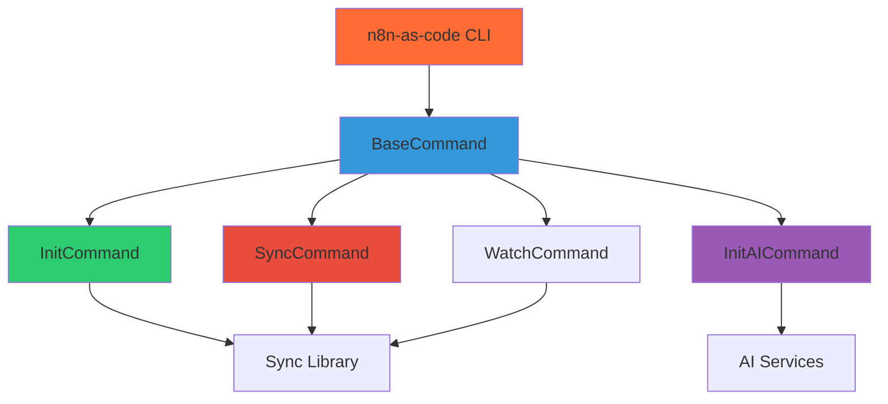

# CLI Package - Development Guide

**Note**: This guide is for developers who want to understand, extend, or contribute to the command-line interface component of n8n-as-code.

## 🎯 Purpose

The CLI package (`@n8n-as-code/cli`) provides a command-line interface for managing n8n workflows from the terminal. It offers:

- **Project Management**: Initialize and configure n8n-as-code projects
- **Workflow Synchronization**: Sync workflows between local files and n8n
- **Watch Mode**: Real-time synchronization on file changes
- **AI Assistance**: AI-powered workflow generation and assistance

## 🏗️ Architecture

### Package Structure
```
packages/cli/
├── src/
│   ├── index.ts              # CLI entry point
│   ├── commands/
│   │   ├── base.ts           # Base command class
│   │   ├── init.ts           # Init command
│   │   ├── init-ai.ts        # AI-assisted init
│   │   ├── sync.ts           # Sync command
│   │   └── watch.ts          # Watch command
│   └── services/
│       └── config-service.ts # Configuration management
├── bin/
│   └── n8n-as-code.js        # CLI executable
├── package.json              # Package manifest
└── tsconfig.json            # TypeScript configuration
```

### Command Hierarchy


## 🧩 Sync Components

### 1. **CLI Entry Point (`index.ts`)**
The main entry point that sets up the CLI application.

**Key Responsibilities:**
- Parse command-line arguments
- Initialize configuration
- Execute appropriate command
- Handle global errors

**Setup:**
```typescript
import { Command } from 'commander';
import { InitCommand, SyncCommand, WatchCommand, InitAICommand } from './commands';

const program = new Command();

program
  .name('n8n-as-code')
  .description('Manage n8n workflows as code')
  .version(version);

// Register commands
new InitCommand(program);
new SyncCommand(program);
new WatchCommand(program);
new InitAICommand(program);

program.parse(process.argv);
```

### 2. **Base Command (`commands/base.ts`)**
Abstract base class for all commands.

**Key Responsibilities:**
- Provide common command functionality
- Handle error reporting
- Manage configuration loading
- Provide logging utilities

**Base Implementation:**
```typescript
abstract class BaseCommand {
  protected config: Config;
  protected logger: Logger;
  
  constructor(protected program: Command) {
    this.config = ConfigService.load();
    this.logger = new Logger(program.opts().verbose);
  }
  
  abstract execute(options: any): Promise<void>;
  
  protected handleError(error: Error): void {
    this.logger.error(error.message);
    process.exit(1);
  }
}
```

### 3. **Init Command (`commands/init.ts`)**
Initializes a new n8n-as-code project.

**Key Responsibilities:**
- Create project directory structure
- Generate configuration files
- Set up n8n instance connections
- Initialize Git repository (optional)

**Implementation:**
```typescript
class InitCommand extends BaseCommand {
  constructor(program: Command) {
    super(program);
    
    program
      .command('init')
      .description('Initialize a new n8n-as-code project')
      .option('--host <url>', 'n8n instance URL')
      .option('--api-key <key>', 'n8n API key')
      .option('--no-git', 'Skip Git initialization')
      .action(this.execute.bind(this));
  }
  
  async execute(options: any): Promise<void> {
    // Create directory structure
    // Generate config file
    // Test connection to n8n
    // Initialize Git if requested
  }
}
```

### 4. **Sync Command (`commands/sync.ts`)**
Synchronizes workflows between local files and n8n.

**Key Responsibilities:**
- Pull workflows from n8n to local files
- Push local workflows to n8n
- Handle conflicts and resolutions
- Provide sync progress reporting

**Sync Modes:**
```typescript
interface SyncOptions {
  mode: 'pull' | 'push' | 'both';
  force: boolean;
  dryRun: boolean;
  instance?: string;
}
```

### 5. **Watch Command (`commands/watch.ts`)**
Watches for file changes and automatically syncs.

**Key Responsibilities:**
- Monitor workflow directory for changes
- Trigger sync on file modifications
- Debounce events to prevent excessive syncing
- Provide real-time status updates

**Watch Implementation:**
```typescript
class WatchCommand extends BaseCommand {
  private watcher: chokidar.FSWatcher;
  
  async execute(options: any): Promise<void> {
    this.watcher = chokidar.watch('workflows/**/*.json', {
      ignored: /(^|[\/\\])\../, // ignore dotfiles
      persistent: true
    });
    
    this.watcher
      .on('change', this.handleChange.bind(this))
      .on('add', this.handleAdd.bind(this))
      .on('unlink', this.handleDelete.bind(this));
  }
}
```

### 6. **Init AI Command (`commands/init-ai.ts`)**
AI-assisted project initialization.

**Key Responsibilities:**
- Generate configuration using AI
- Suggest workflow templates
- Provide intelligent defaults
- Learn from user preferences

### 7. **Config Service (`services/config-service.ts`)**
Manages CLI configuration.

**Key Responsibilities:**
- Load configuration from multiple sources
- Validate configuration
- Merge environment variables and file config
- Provide typed configuration access

**Configuration Sources:**
1. **File**: `n8n-as-code.json` or `n8n-as-code.config.js`
2. **Environment Variables**: `N8N_HOST`, `N8N_API_KEY`, etc.
3. **Command Line**: CLI arguments
4. **Defaults**: Built-in default values

## 🔄 Integration with Sync Library

### Sync Library Usage
The CLI uses the Sync library for all n8n operations:

```typescript
import { SyncManager, StateManager, N8nApiClient } from '@n8n-as-code/sync';

class SyncCommand extends BaseCommand {
  private syncManager: SyncManager;
  
  constructor() {
    super();
    this.syncManager = new SyncManager(this.config);
  }
  
  async execute(options: any): Promise<void> {
    const result = await this.syncManager.sync({
      mode: options.mode,
      force: options.force
    });
    
    this.logger.reportSyncResult(result);
  }
}
```

### Event Handling
The CLI listens to Sync library events:

```typescript
syncManager.on('sync:progress', (progress) => {
  this.logger.progress(progress);
});

syncManager.on('sync:conflict', (conflict) => {
  this.logger.conflict(conflict);
  // Prompt user for resolution
});

syncManager.on('sync:complete', (result) => {
  this.logger.success(`Synced ${result.synced} workflows`);
});
```

## 🛠️ Development Setup

### Prerequisites
- Node.js 18+
- n8n instance for testing
- Git (for version control features)

### Local Development
```bash
# Install dependencies
cd packages/cli
npm install

# Build CLI
npm run build

# Link for local testing
npm link

# Test commands
n8n-as-code --help
```

### Testing with Local n8n
1. Start a local n8n instance
2. Get API key from n8n settings
3. Configure CLI:
```bash
n8n-as-code init --host http://localhost:5678 --api-key your-key
```

## 🔧 Adding New Commands

### Step 1: Create Command Class
```typescript
// commands/new-command.ts
import { Command } from 'commander';
import { BaseCommand } from './base';

export class NewCommand extends BaseCommand {
  constructor(program: Command) {
    super(program);
    
    program
      .command('new-command')
      .description('Description of new command')
      .option('--option <value>', 'Option description')
      .action(this.execute.bind(this));
  }
  
  async execute(options: any): Promise<void> {
    // Command implementation
    this.logger.info('New command executed');
  }
}
```

### Step 2: Register Command
```typescript
// index.ts
import { NewCommand } from './commands/new-command';

// Add to command registration
new NewCommand(program);
```

### Step 3: Update TypeScript Configuration
Ensure the new command is included in the build.

## 🧪 Testing

### Test Structure
```
packages/cli/
└── tests/
    ├── unit/
    │   ├── commands/
    │   │   ├── init.test.ts
    │   │   └── sync.test.ts
    │   └── services/
    │       └── config-service.test.ts
    └── integration/
        └── cli-integration.test.ts
```

### Running Tests
```bash
cd packages/cli
npm test
```

### Mocking
Mock file system and n8n API for testing:

```typescript
import mockFs from 'mock-fs';
import nock from 'nock';

beforeEach(() => {
  mockFs({
    'workflows': {},
    'n8n-as-code.json': JSON.stringify({ host: 'http://test.n8n' })
  });
  
  nock('http://test.n8n')
    .get('/api/v1/workflows')
    .reply(200, []);
});

afterEach(() => {
  mockFs.restore();
  nock.cleanAll();
});
```

## 📦 Packaging and Distribution

### Building for Production
```bash
npm run build
```

### Creating Executable
The CLI uses `pkg` or `nexe` for creating standalone executables:

```json
{
  "bin": {
    "n8n-as-code": "./bin/n8n-as-code.js"
  }
}
```

### Publishing to npm
```bash
npm version patch
npm publish
```

## 🔐 Security Considerations

### API Key Management
- **Never Log**: API keys are never logged
- **Environment Variables**: Preferred over config files
- **Encryption**: Optional encryption for stored keys

### Input Validation
- **Validate All Inputs**: Host URLs, file paths, etc.
- **Sanitize Outputs**: Prevent injection attacks
- **Rate Limiting**: Prevent abuse of n8n API

## 📈 Performance Optimization

### Command Performance
- **Lazy Loading**: Load Sync library only when needed
- **Caching**: Cache configuration and API responses
- **Parallel Processing**: Sync multiple workflows in parallel

### Memory Management
- **Stream Processing**: Process large workflows as streams
- **Cleanup**: Proper disposal of resources
- **Monitoring**: Track memory usage

## 🐛 Troubleshooting

### Common Issues

#### Connection Failed
```bash
# Test connection manually
curl -H "X-N8N-API-KEY: your-key" https://your-n8n.com/api/v1/workflows
```

#### Configuration Not Found
1. Check current directory for `n8n-as-code.json`
2. Verify environment variables are set
3. Run `n8n-as-code init` to create config

#### Sync Conflicts
1. Review conflict details in output
2. Use `--force` to overwrite (with caution)
3. Manually resolve in n8n UI

### Debug Mode
Enable verbose logging:
```bash
n8n-as-code sync --verbose
```

### Log Files
Check log files in `~/.n8n-as-code/logs/` for detailed error information.

## 📚 Related Documentation

- [Sync Package](/docs/contribution/core): Sync library details
- [Architecture Overview](/docs/contribution/architecture): Overall system architecture
- [VS Code Extension](/docs/contribution/vscode-extension): VS Code extension development
- [Contribution Guide](/docs/contribution): How to contribute

---

*The CLI package provides powerful command-line tools for n8n workflow management, enabling automation, scripting, and integration with other development tools.*
