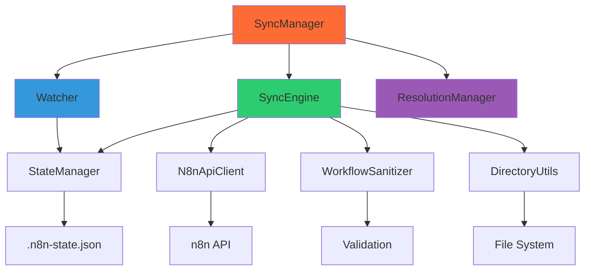
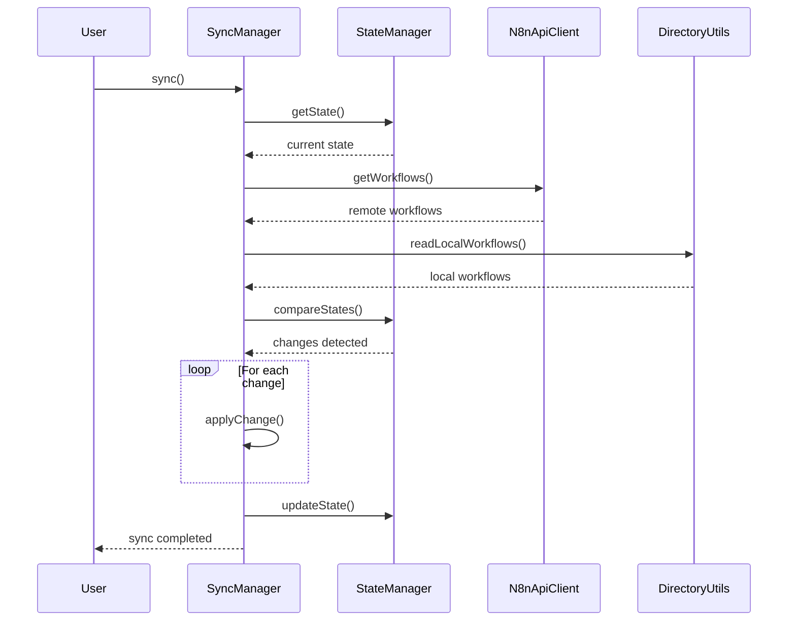

# Core Package - Shared Library Documentation

**Note**: This package is a shared dependency used by all other n8n-as-code packages. It provides the foundational services for workflow management.

## 🎯 Purpose

The Core package (`@n8n-as-code/sync`) provides the shared business logic and services used by:
- **VS Code Extension**: For workflow synchronization and management
- **CLI**: For command-line operations
- **Agent CLI**: For AI context generation

It encapsulates all n8n API interactions, state management, and synchronization logic.

## 🏗️ Architecture

### 3-Way Merge Architecture

The Core package implements a **3-way merge architecture** that separates concerns cleanly:



**Key Design Principles:**

1. **Watcher** observes state (file system + API) and emits status events
2. **SyncEngine** mutates state (performs I/O operations)
3. **ResolutionManager** handles interactive conflict resolution
4. **SyncManager** orchestrates the components
5. **StateManager** maintains the "base" state for 3-way comparison

### Package Dependencies
```json
{
  "dependencies": {
    "axios": "^1.6.0",          // HTTP client for n8n API
    "fs-extra": "^11.1.1",      // Enhanced file system operations
    "json-schema": "^0.4.0",    // JSON Schema validation
    "chokidar": "^3.5.3"        // File watching
  }
}
```

## 🧩 Core Services

### 1. **Watcher** (`src/services/watcher.ts`)
Passive observer service that detects changes without performing synchronization.

**Key Responsibilities:**
- Watch file system for local changes using `chokidar` (debounced 500ms)
- Poll n8n API for remote changes (configurable interval)
- Calculate workflow status using 3-way comparison
- Emit status events for SyncManager to handle
- Never perform any synchronization operations (read-only)

**Events Emitted:**
```typescript
watcher.on('status-changed', (status: IWorkflowStatus) => {...});
watcher.on('conflict', (conflict: IWorkflowStatus) => {...});
watcher.on('deletion', (deletion: IWorkflowStatus) => {...});
```

**Status Detection Algorithm:**
Uses 3-way merge comparison (base vs local vs remote):
```typescript
// Pseudo-code for status detection
if (!existsLocally && !existsRemotely) return null;
if (!existsLocally) return DELETED_LOCALLY;
if (!existsRemotely && !lastSynced) return EXIST_ONLY_LOCALLY;
if (!existsRemotely && lastSynced) return DELETED_REMOTELY;
if (!lastSynced) return EXIST_ONLY_REMOTELY;

if (localHash === remoteHash) return IN_SYNC;
if (localHash === lastSyncedHash) return MODIFIED_REMOTELY;
if (remoteHash === lastSyncedHash) return MODIFIED_LOCALLY;
return CONFLICT; // Both changed since last sync
```

### 2. **SyncEngine** (`src/services/sync-engine.ts`)
Stateless I/O executor that performs actual synchronization operations.

**Key Responsibilities:**
- Execute push operations (local → remote)
- Execute pull operations (remote → local)
- Delete workflows from local or remote
- Finalize sync by updating `.n8n-state.json`
- Create backups before destructive operations
- Never decide what to sync (receives instructions from SyncManager)

**Core Methods:**
```typescript
class SyncEngine {
  async push(workflow: IWorkflowStatus): Promise<void>;
  async pull(workflow: IWorkflowStatus): Promise<void>;
  async delete(workflow: IWorkflowStatus, target: 'local' | 'remote'): Promise<void>;
  async finalizeSync(workflowId: string, filename: string): Promise<void>;
}
```

**Atomic Operations:**
- Uses temporary files for safe writes
- Creates timestamped backups in `.trash/` directory
- Updates state only after successful API/file operations

### 3. **ResolutionManager** (`src/services/resolution-manager.ts`)
Handles interactive conflict and deletion resolution.

**Key Responsibilities:**
- Prompt user for conflict resolution choices
- Prompt user for deletion confirmation
- Display diffs between local and remote versions
- Keep resolution logic separate from sync logic

**Resolution Flow:**
```typescript
class ResolutionManager {
  async promptForConflict(workflow: IWorkflowStatus): Promise<'local' | 'remote' | 'skip'>;
  async promptForDeletion(workflow: IWorkflowStatus): Promise<'delete' | 'restore' | 'skip'>;
  async showDiff(workflow: IWorkflowStatus): Promise<void>;
}
```

### 4. **SyncManager** (`src/services/sync-manager.ts`)
High-level orchestrator that coordinates all components.

**Key Responsibilities:**
- Orchestrate Watcher, SyncEngine, and ResolutionManager
- Implement high-level sync strategies (syncUp, syncDown, startWatching)
- Handle event forwarding and aggregation
- Provide public API for CLI and VS Code extension

**Public API:**
```typescript
class SyncManager extends EventEmitter {
  async refreshState(): Promise<void>;
  async syncUp(): Promise<void>;
  async syncDown(): Promise<void>;
  async startWatching(): Promise<void>;
  async stopWatching(): Promise<void>;
  async getWorkflowsStatus(): Promise<IWorkflowStatus[]>;
  async resolveConflict(id: string, filename: string, choice: 'local' | 'remote'): Promise<void>;
}
```

**Events Emitted:**
```typescript
syncManager.on('log', (message: string) => {...});
syncManager.on('conflict', (conflict: IWorkflowStatus) => {...});
syncManager.on('deletion', (deletion: IWorkflowStatus) => {...});
syncManager.on('statusChanged', (status: IWorkflowStatus) => {...});
```

### 5. **StateManager** (`src/services/state-manager.ts`)
Manages `.n8n-state.json` file that tracks the "base" state for 3-way merge.

**Key Responsibilities:**
- Load and save `.n8n-state.json`
- Track `lastSyncedHash` and `lastSyncedAt` for each workflow
- Provide the "base" state for 3-way comparison
- Enable deterministic conflict detection

**State File Structure:**
```typescript
interface IInstanceState {
  workflows: {
    [workflowId: string]: IWorkflowState;
  };
}

interface IWorkflowState {
  lastSyncedHash: string;  // SHA-256 hash of last synced content
  lastSyncedAt: string;    // ISO timestamp
}
```

**Core Methods:**
```typescript
class StateManager {
  async loadState(): Promise<IInstanceState>;
  async saveState(state: IInstanceState): Promise<void>;
  async updateWorkflowState(workflowId: string, hash: string): Promise<void>;
  getWorkflowState(workflowId: string): IWorkflowState | undefined;
}
```

### 6. **N8nApiClient** (`src/services/n8n-api-client.ts`)
Communicates with the n8n REST API.

**Key Responsibilities:**
- Handle authentication and API key management
- Make HTTP requests to n8n endpoints
- Handle rate limiting and retries
- Parse and validate API responses

**API Endpoints:**
```typescript
interface N8nApiClient {
  // Workflow operations
  getWorkflows(): Promise<Workflow[]>;
  getWorkflow(id: string): Promise<Workflow>;
  createWorkflow(workflow: Workflow): Promise<Workflow>;
  updateWorkflow(id: string, workflow: Workflow): Promise<Workflow>;
  deleteWorkflow(id: string): Promise<void>;
  
  // Instance operations
  getInstances(): Promise<Instance[]>;
  getInstance(id: string): Promise<Instance>;
  
  // Health check
  healthCheck(): Promise<HealthStatus>;
}
```

### 7. **WorkflowSanitizer** (`src/services/workflow-sanitizer.ts`)
Validates and sanitizes workflow JSON.

**Key Responsibilities:**
- Validate workflow structure against n8n schema
- Remove sensitive data (credentials, API keys)
- Normalize workflow format
- Fix common issues and inconsistencies

**Sanitization Process:**
```typescript
interface WorkflowSanitizer {
  sanitize(workflow: any): SanitizedWorkflow;
  validate(workflow: any): ValidationResult;
  normalize(workflow: any): NormalizedWorkflow;
  removeCredentials(workflow: any): CredentialFreeWorkflow;
}
```

### 8. **DirectoryUtils** (`src/services/directory-utils.ts`)
Manages file system operations for workflows.

**Key Responsibilities:**
- Create and manage workflow directory structure
- Handle file I/O operations
- Organize workflows by instance
- Provide path utilities

**Directory Structure:**
```
workflows/
├── instance1/
│   ├── workflow-a.json
│   └── workflow-b.json
├── instance2/
│   └── workflow-c.json
└── .state.json
```

### 6. **TrashService**
Manages deleted workflows and provides recovery.

**Key Responsibilities:**
- Move deleted workflows to trash
- Provide trash management operations
- Support workflow recovery
- Automatic trash cleanup

## 🔄 Sync Process

### Full Sync Flow


### Conflict Resolution
1. **Detection**: StateManager detects hash mismatch
2. **Analysis**: Determine conflict type (edit/edit, delete/edit, etc.)
3. **Notification**: Report conflict to user
4. **Resolution**: Apply resolution strategy
5. **Sync**: Continue with resolved workflow

## 📊 State Management

### State File Structure
```json
{
  "version": "1.0.0",
  "workflows": {
    "workflow-id-1": {
      "id": "workflow-id-1",
      "name": "My Workflow",
      "localPath": "workflows/instance1/my-workflow.json",
      "remoteId": "123",
      "localHash": "abc123",
      "remoteHash": "def456",
      "lastSync": "2024-01-13T09:41:02.177Z",
      "status": "synced"
    }
  },
  "instances": {
    "instance1": {
      "host": "https://n8n.example.com",
      "lastSync": "2024-01-13T09:41:02.177Z"
    }
  }
}
```

### State Operations
- **Read State**: Load from `.state.json`
- **Update State**: Modify and save state
- **Merge States**: Combine multiple state sources
- **Validate State**: Ensure state consistency

## 🔐 Security

### Credential Handling
- **Never Store**: Credentials are never stored in state or files
- **API Key Encryption**: API keys encrypted in memory
- **Secure Transmission**: HTTPS for all API calls
- **Input Validation**: Validate all inputs before processing

### Data Sanitization
- **Workflow Sanitization**: Remove credentials before storage
- **Error Messages**: Sanitize error messages to avoid information leakage
- **Logging**: No sensitive data in logs

## 🧪 Testing

### Test Structure
```
packages/sync/tests/
├── unit/
│   ├── state-manager.test.ts
│   └── workflow-sanitizer.test.ts
└── integration/
    └── sync-scenarios.test.ts
```

### Test Coverage
- **Unit Tests**: Individual service testing
- **Integration Tests**: Service interaction testing
- **Mocking**: Nock for HTTP, mock-fs for file system
- **Snapshot Tests**: State persistence testing

### Running Tests
```bash
cd packages/sync
npm test
```

## 📈 Performance

### Optimization Strategies
- **Batch Operations**: Process multiple workflows in batches
- **Caching**: Cache API responses and file reads
- **Incremental Sync**: Only sync changed workflows
- **Parallel Processing**: Concurrent operations where safe

### Memory Management
- **Stream Processing**: Process large workflows as streams
- **Cleanup**: Proper disposal of resources
- **Monitoring**: Track memory usage and leaks

## 🔧 Configuration

### Configuration Interface
```typescript
interface CoreConfig {
  host: string;
  apiKey: string;
  syncFolder: string;
  syncMode: 'auto' | 'manual';
  pollInterval: number;
  maxRetries: number;
  timeout: number;
  ignorePatterns: string[];
}
```

### Configuration Sources
1. **File**: `n8n-as-code.json`
2. **Environment Variables**: `N8N_HOST`, `N8N_API_KEY`, etc.
3. **Command Line**: CLI arguments
4. **Defaults**: Built-in default values

## 🚀 Development

### Building
```bash
cd packages/sync
npm run build
```

### Development Mode
```bash
cd packages/sync
npm run dev
```

### TypeScript Configuration
```json
{
  "extends": "../../tsconfig.base.json",
  "compilerOptions": {
    "outDir": "./dist",
    "rootDir": "./src",
    "declaration": true,
    "declarationMap": true
  }
}
```

## 📚 Related Documentation

- [Architecture Overview](/docs/contribution/architecture): Overall system architecture
- [Agent CLI](/docs/contribution/agent-cli): AI integration details
- [Contribution Guide](/docs/contribution): How to contribute

---

*The Core package provides the foundation for all n8n-as-code functionality, ensuring consistent behavior across different interfaces while maintaining security and performance.*