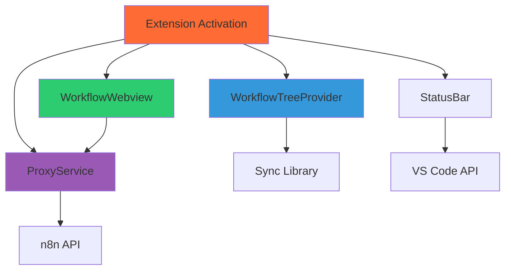

# VS Code Extension - Development Guide

**Note**: This guide is for developers who want to understand, extend, or contribute to the VS Code extension component of n8n-as-code.

## 🎯 Purpose

The VS Code extension (`@n8n-as-code/vscode-extension`) provides a visual interface for managing n8n workflows directly within VS Code. It integrates with the Sync library to offer:

- **Workflow Tree View**: Browse workflows organized by n8n instance
- **Visual Editing**: Webview-based n8n canvas for workflow editing
- **Real-time Sync**: Automatic synchronization with n8n instances
- **Proxy Service**: Secure communication between VS Code and n8n

## 🏗️ Architecture

### Extension Structure
```
packages/vscode-extension/
├── src/
│   ├── extension.ts              # Main extension entry point
│   ├── services/
│   │   └── proxy-service.ts      # Proxy between VS Code and n8n
│   └── ui/
│       ├── status-bar.ts         # Status bar integration
│       ├── workflow-tree-provider.ts # Tree view provider
│       └── workflow-webview.ts   # Webview for workflow editing
├── package.json                  # Extension manifest
└── tsconfig.json                # TypeScript configuration
```

### Component Relationships


## 🧩 Sync Components

### 1. **Extension Entry Point (`extension.ts`)**
The main entry point that activates the extension.

**Key Responsibilities:**
- Register all extension components
- Manage extension lifecycle (activate/deactivate)
- Handle configuration changes
- Initialize Sync library integration

**Activation Flow:**
```typescript
export function activate(context: vscode.ExtensionContext) {
  // Initialize services
  const proxyService = new ProxyService(context);
  const treeProvider = new WorkflowTreeProvider(context, proxyService);
  const statusBar = new StatusBar(context);
  
  // Register providers
  vscode.window.registerTreeDataProvider('n8n-workflows', treeProvider);
  vscode.commands.registerCommand('n8n.refresh', () => treeProvider.refresh());
  
  // Register webview
  vscode.commands.registerCommand('n8n.openWorkflow', (workflow) => {
    WorkflowWebview.createOrShow(context, workflow, proxyService);
  });
}
```

### 2. **Workflow Tree Provider (`workflow-tree-provider.ts`)**
Provides the tree view for browsing workflows.

**Key Responsibilities:**
- Fetch workflows from Sync library
- Organize workflows by instance
- Handle tree item interactions
- Refresh on changes

**Tree Item Structure:**
```typescript
interface WorkflowTreeItem extends vscode.TreeItem {
  type: 'instance' | 'workflow' | 'category';
  instanceId?: string;
  workflowId?: string;
  children?: WorkflowTreeItem[];
}
```

### 3. **Workflow Webview (`workflow-webview.ts`)**
Renders the n8n canvas in a webview for visual editing.

**Key Responsibilities:**
- Create and manage webview panel
- Load n8n editor interface
- Handle messages between webview and extension
- Save workflow changes

**Webview Communication:**
```typescript
// Extension to webview
webview.postMessage({
  type: 'workflow:load',
  workflow: workflowData
});

// Webview to extension
webview.onDidReceiveMessage(async (message) => {
  switch (message.type) {
    case 'workflow:save':
      await proxyService.updateWorkflow(message.workflow);
      break;
  }
});
```

### 4. **Proxy Service (`proxy-service.ts`)**
Acts as a secure proxy between VS Code and n8n API.

**Key Responsibilities:**
- Forward API requests from webview to n8n
- Handle authentication and CORS
- Cache responses for performance
- Provide error handling

**Proxy Implementation:**
```typescript
class ProxyService {
  async forwardRequest(endpoint: string, method: string, data?: any) {
    // Add authentication headers
    // Forward to n8n API
    // Return response to webview
  }
}
```

### 5. **Status Bar (`status-bar.ts`)**
Shows sync status and quick actions in VS Code status bar.

**Key Responsibilities:**
- Display sync status (syncing, error, success)
- Provide quick access to common commands
- Update based on sync events

## 🔄 Integration with Sync Library

### Dependency Injection
The extension uses the Sync library through dependency injection:

```typescript
import { SyncManager, StateManager } from '@n8n-as-code/sync';

class ExtensionServices {
  private syncManager: SyncManager;
  private stateManager: StateManager;
  
  constructor() {
    this.syncManager = new SyncManager(config);
    this.stateManager = new StateManager(config);
  }
}
```

### Sync Events
The extension listens to sync events from Sync:

```typescript
syncManager.on('sync:start', () => {
  statusBar.showSyncing();
});

syncManager.on('sync:complete', (result) => {
  statusBar.showSynced();
  treeProvider.refresh();
});

syncManager.on('sync:error', (error) => {
  vscode.window.showErrorMessage(`Sync failed: ${error.message}`);
});
```

## 🛠️ Development Setup

### Prerequisites
- VS Code Extension Development environment
- Node.js 18+
- n8n instance for testing

### Local Development
```bash
# Install dependencies
cd packages/vscode-extension
npm install

# Build extension
npm run compile

# Run in development mode
npm run watch

# Open VS Code with extension
code .
```

### Debugging
1. **F5**: Launch extension in debug mode
2. **Webview DevTools**: Right-click in webview → "Inspect"
3. **Extension Host Logs**: View output in "Debug Console"

## 🔧 Extension Points

### Custom Commands
Add new commands by registering them in `extension.ts`:

```typescript
vscode.commands.registerCommand('n8n.customCommand', async () => {
  // Implement custom functionality
});
```

### Custom Tree Items
Extend the tree view by adding new item types:

```typescript
class CustomTreeItem extends WorkflowTreeItem {
  constructor(label: string) {
    super(label, vscode.TreeItemCollapsibleState.None);
    this.contextValue = 'customItem';
  }
}
```

### Webview Customization
Extend the webview with additional functionality:

```typescript
class CustomWebview extends WorkflowWebview {
  protected getAdditionalHtml(): string {
    return '<button id="custom-action">Custom Action</button>';
  }
  
  protected handleCustomMessage(message: any): boolean {
    if (message.type === 'custom:action') {
      this.handleCustomAction();
      return true;
    }
    return false;
  }
}
```

## 🧪 Testing

### Test Structure
```
packages/vscode-extension/
└── tests/
    ├── unit/
    │   ├── proxy-service.test.ts
    │   └── workflow-tree-provider.test.ts
    └── integration/
        └── webview.test.ts
```

### Running Tests
```bash
cd packages/vscode-extension
npm test
```

### Mocking VS Code API
Use `vscode-test` library for testing:

```typescript
import * as vscode from 'vscode-test';

const mockExtensionContext: vscode.ExtensionContext = {
  subscriptions: [],
  workspaceState: mockWorkspaceState,
  globalState: mockGlobalState,
  extensionPath: '/mock/path'
};
```

## 📦 Packaging and Distribution

### Building for Production
```bash
npm run package
```

### VS Code Marketplace
1. Update `package.json` version
2. Run `vsce package`
3. Publish to Marketplace

### Manual Installation
Package can be installed from `.vsix` file:
```bash
code --install-extension n8n-as-code-*.vsix
```

## 🔐 Security Considerations

### Webview Security
- **Content Security Policy**: Restrict resources
- **Message Validation**: Validate all webview messages
- **Input Sanitization**: Sanitize user inputs

### Proxy Security
- **Authentication**: Never expose API keys to webview
- **Request Validation**: Validate all proxied requests
- **Rate Limiting**: Prevent abuse

## 📈 Performance Optimization

### Webview Performance
- **Lazy Loading**: Load resources on demand
- **Caching**: Cache workflow data
- **Virtualization**: Virtualize tree view for large datasets

### Extension Startup
- **Deferred Activation**: Activate on command, not startup
- **Background Initialization**: Initialize services in background
- **Resource Cleanup**: Properly dispose resources

## 🐛 Troubleshooting

### Common Issues

#### Webview Not Loading
1. Check CSP in webview HTML
2. Verify resource paths are correct
3. Check console errors in webview DevTools

#### Proxy Connection Failed
1. Verify n8n instance is accessible
2. Check API key permissions
3. Verify CORS settings on n8n

#### Tree View Not Refreshing
1. Check event subscriptions
2. Verify Sync library connection
3. Check for errors in extension host

### Debugging Tips
- Use `Developer: Toggle Developer Tools` in VS Code
- Check Output panel for extension logs
- Enable verbose logging in extension settings

## 📚 Related Documentation

- [Sync Package](/docs/contribution/sync): Sync library details
- [Architecture Overview](/docs/contribution/architecture): Overall system architecture
- [Contribution Guide](/docs/contribution): How to contribute

---

*The VS Code extension provides a seamless visual interface for n8n workflow management, bridging the gap between code-based workflow management and visual editing.*
