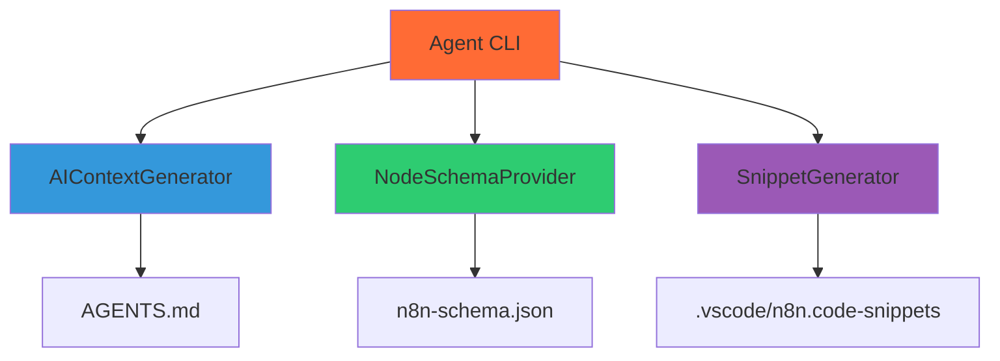

# Agent CLI - Internal Documentation

**Note**: This package is an internal dependency used by AI assistants. End users do not interact with it directly.

## 🎯 Purpose

The Agent CLI (`@n8n-as-code/agent-cli`) generates AI context files that help AI assistants understand and work with n8n workflows. It creates:

1. **AGENTS.md**: Instructions for AI assistants
2. **n8n-schema.json**: Validation schema for n8n workflows
3. **Code Snippets**: VS Code snippets for common n8n patterns

## 🏗️ Architecture

### Component Diagram


### Core Components

#### 1. **AIContextGenerator**
Generates the `AGENTS.md` file with instructions for AI assistants.

**Key Features:**
- Provides n8n-as-code context and rules
- Includes workflow structure guidelines
- Documents expression syntax and patterns
- Specifies validation requirements

#### 2. **NodeSchemaProvider**
Generates the `n8n-schema.json` validation schema.

**Key Features:**
- Extracts node schemas from n8n documentation
- Creates JSON Schema for validation
- Supports type checking and autocomplete
- Provides error messages for invalid workflows

#### 3. **SnippetGenerator**
Generates VS Code snippets for common n8n patterns.

**Key Features:**
- Creates code snippets for common nodes
- Supports tab stops and placeholders
- Organized by node category
- Includes documentation links

## 📁 Generated Files

### AGENTS.md
```markdown
# 🤖 AGENTS.md - Context for AI Agents
> **CRITICAL**: Read this file before creating or modifying any n8n workflow files.

## 🎭 Role & Objective
You are an **Expert n8n Automation Engineer**. Your goal is to manage n8n workflows as **clean, version-controlled code** (JSON) while maintaining full compatibility with the n8n Visual Editor.

## 🌍 Instance Context
- **n8n Version**: 2.2.6
- **Environment**: Production/Dev (Inferred)

## 🛠 Coding Standards & Syntax Rules
1. **JSON Structure**: Workflows are stored as standard .json files.
2. **Expressions**: Use standard n8n expression syntax: `{{ $json.myField }}`
3. **Node Configuration**: Prefer the new `Code` node type over legacy `Function`.
4. **Git Workflow**: Never commit credentials. Use n8n Credentials store.
```

### n8n-schema.json
```json
{
  "$schema": "http://json-schema.org/draft-07/schema#",
  "title": "n8n Workflow Schema",
  "description": "JSON Schema for n8n workflows",
  "type": "object",
  "properties": {
    "name": {
      "type": "string",
      "description": "Workflow name"
    },
    "nodes": {
      "type": "array",
      "description": "Array of workflow nodes",
      "items": {
        "$ref": "#/definitions/node"
      }
    }
  },
  "required": ["name", "nodes"]
}
```

### .vscode/n8n.code-snippets
```json
{
  "Webhook Trigger": {
    "prefix": "node:webhook",
    "body": [
      "{",
      "  \"name\": \"Webhook\",",
      "  \"type\": \"n8n-nodes-base.webhook\",",
      "  \"position\": [250, 300],",
      "  \"parameters\": {",
      "    \"path\": \"${1:webhook}\",",
      "    \"options\": {}",
      "  }",
      "}"
    ],
    "description": "Webhook trigger node"
  }
}
```

## 🔧 Usage

### Command Line
```bash
# Generate all AI context files
npx @n8n-as-code/agent-cli generate

# Generate specific files
npx @n8n-as-code/agent-cli generate --only agents
npx @n8n-as-code/agent-cli generate --only schema
npx @n8n-as-code/agent-cli generate --only snippets

# Update existing files
npx @n8n-as-code/agent-cli generate --force
```

### Programmatic API
```typescript
import { generateAIContext } from '@n8n-as-code/agent-cli';

// Generate all context files
await generateAIContext({
  outputDir: './',
  force: false,
  components: ['agents', 'schema', 'snippets']
});
```

## 🧠 How AI Assistants Use This

### 1. **Context Understanding**
AI assistants read `AGENTS.md` to understand:
- Their role as n8n Automation Engineer
- n8n version and environment context
- Coding standards and syntax rules
- Git workflow and security requirements

### 2. **Validation**
AI assistants use `n8n-schema.json` to:
- Validate workflow JSON structure
- Provide autocomplete suggestions
- Generate type-safe workflow code
- Catch errors before runtime

### 3. **Code Generation**
AI assistants use snippets to:
- Generate common node patterns quickly
- Ensure consistent node configuration
- Follow best practices automatically
- Reduce manual typing errors

## 🔄 Integration with Other Packages

### VS Code Extension
The VS Code extension automatically runs the Agent CLI when:
1. A new project is initialized
2. The extension detects missing context files
3. User requests AI context generation

### CLI
The main CLI includes the `init-ai` command:
```bash
n8n-as-code init-ai
```

This command delegates to the Agent CLI to generate context files.

## 🧪 Testing

### Test Structure
```
packages/agent-cli/tests/
├── ai-context-generator.test.ts
├── node-schema-provider.test.ts
└── snippet-generator.test.ts
```

### Test Coverage
- **Unit Tests**: Individual component testing
- **Integration Tests**: End-to-end generation testing
- **Snapshot Tests**: Ensure generated files match expected format

### Running Tests
```bash
cd packages/agent-cli
npm test
```

## 📊 Performance Considerations

### Caching
- Node schemas are cached to avoid repeated API calls
- Generated files are cached with hash comparison
- Only regenerate when source data changes

### Optimization
- Parallel generation of different file types
- Incremental updates for large schemas
- Memory-efficient processing for large node libraries

## 🔐 Security

### Data Handling
- No sensitive data in generated files
- Public n8n documentation only
- No API keys or credentials

### Validation
- Generated files are validated before writing
- Schema validation ensures correctness
- File permissions are set appropriately

## 🚀 Development

### Building
```bash
cd packages/agent-cli
npm run build
```

### Development Mode
```bash
cd packages/agent-cli
npm run dev
```

### Adding New Node Types
1. Update the node schema extraction logic
2. Add new snippet templates
3. Update test snapshots
4. Regenerate context files


## 📚 Related Documentation

- [Architecture Overview](/docs/contributors/architecture): Overall system architecture
- [Core Package](/docs/contributors/core): Shared library details
- [Contributing Guide](/docs/contributors): How to contribute

---

*The Agent CLI enables AI assistants to work effectively with n8n workflows by providing comprehensive context, validation, and code generation capabilities.*