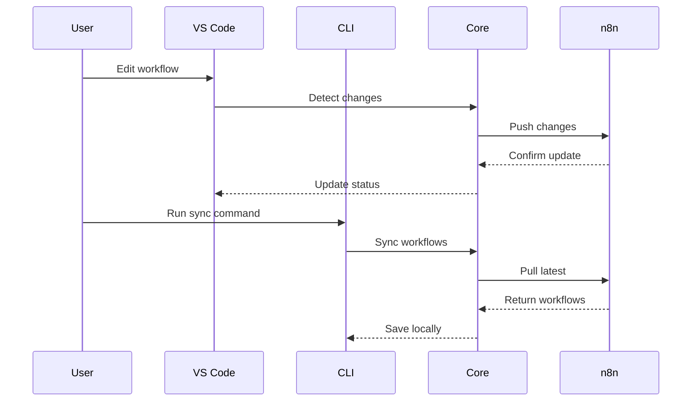

# Architecture Overview

n8n-as-code is a monorepo built with a modular architecture that separates concerns while maintaining tight integration between components.

## 🏗️ Monorepo Structure

```
n8n-as-code/
├── packages/
│   ├── core/           # Core library (shared logic)
│   ├── cli/            # Command-line interface
│   ├── agent-cli/      # AI agent integration
│   └── vscode-extension/ # VS Code extension
├── docs/               # Documentation (Docusaurus)
├── scripts/            # Build and utility scripts
└── plans/              # Architecture planning documents
```

## 📦 Package Dependencies

```mermaid
graph TD
    A[VS Code Extension] --> B[Core Library]
    C[CLI] --> B
    D[Agent CLI] --> B
    B --> E[n8n API]
    
    style A fill:#ff6b35
    style C fill:#ff6b35
    style D fill:#ff6b35
    style B fill:#2c3e50
```



### Dependency Flow
1. **Core Library** (`@n8n-as-code/core`): Shared business logic
2. **CLI** (`@n8n-as-code/cli`): Command-line interface using Core
3. **VS Code Extension**: Visual interface using Core
4. **Agent CLI** (`@n8n-as-code/agent-cli`): AI integration using Core

## 🧩 Core Library Architecture

### Service Layer
```typescript
// Core services architecture
classDiagram
    class SyncManager {
        +sync()
        +pull()
        +push()
    }
    
    class StateManager {
        +getState()
        +updateState()
        +detectChanges()
    }
    
    class N8nApiClient {
        +getWorkflows()
        +updateWorkflow()
        +createWorkflow()
    }
    
    class WorkflowSanitizer {
        +sanitize()
        +validate()
    }
    
    SyncManager --> StateManager
    SyncManager --> N8nApiClient
    SyncManager --> WorkflowSanitizer
```

### Key Components

#### 1. **Sync Manager**
- Orchestrates synchronization between n8n and local files
- Handles conflict detection and resolution
- Manages sync modes (auto/manual)

#### 2. **State Manager**
- Tracks workflow state and changes
- Detects modifications and conflicts
- Maintains consistency across operations

#### 3. **N8n API Client**
- Communicates with n8n REST API
- Handles authentication and rate limiting
- Provides typed API responses

#### 4. **Workflow Sanitizer**
- Validates workflow JSON structure
- Removes sensitive data (credentials)
- Ensures compatibility with n8n

## 🔌 VS Code Extension Architecture

### Extension Components
```typescript
// VS Code extension architecture
classDiagram
    class Extension {
        +activate()
        +deactivate()
    }
    
    class WorkflowTreeProvider {
        +getTreeItem()
        +getChildren()
        +refresh()
    }
    
    class WorkflowWebview {
        +render()
        +update()
        +handleMessage()
    }
    
    class ProxyService {
        +forwardRequest()
        +handleResponse()
    }
    
    Extension --> WorkflowTreeProvider
    Extension --> WorkflowWebview
    Extension --> ProxyService
    WorkflowWebview --> ProxyService
```

### Communication Flow
1. **Tree View**: Displays workflows organized by instance
2. **Webview**: Renders n8n canvas for visual editing
3. **Proxy Service**: Bridges VS Code and n8n API
4. **Sync Integration**: Uses Core library for synchronization

## 🖥️ CLI Architecture

### Command Structure
```typescript
// CLI command architecture
classDiagram
    class CLI {
        +parseArgs()
        +executeCommand()
    }
    
    class BaseCommand {
        +run()
        +validate()
        +execute()
    }
    
    class InitCommand {
        +initializeProject()
        +createConfig()
    }
    
    class SyncCommand {
        +syncWorkflows()
        +handleConflicts()
    }
    
    class WatchCommand {
        +watchChanges()
        +autoSync()
    }
    
    CLI --> BaseCommand
    BaseCommand <|-- InitCommand
    BaseCommand <|-- SyncCommand
    BaseCommand <|-- WatchCommand
```

### Command Processing
1. **Argument Parsing**: Commander.js for CLI parsing
2. **Command Execution**: Each command extends BaseCommand
3. **Configuration**: Loads from file, env vars, or args
4. **Error Handling**: Consistent error reporting

## 🤖 Agent CLI Architecture

### AI Integration
```typescript
// Agent CLI architecture
classDiagram
    class AgentCLI {
        +generateContext()
        +processRequest()
    }
    
    class AIContextGenerator {
        +generateAgentsMD()
        +generateSchema()
        +generateSnippets()
    }
    
    class NodeSchemaProvider {
        +getNodeSchemas()
        +validateNode()
    }
    
    class SnippetGenerator {
        +generateSnippets()
        +formatSnippet()
    }
    
    AgentCLI --> AIContextGenerator
    AgentCLI --> NodeSchemaProvider
    AgentCLI --> SnippetGenerator
```

### Context Generation
1. **AGENTS.md**: Instructions for AI assistants
2. **n8n-schema.json**: Validation schema
3. **Code Snippets**: VS Code snippets for common patterns

## 🔄 Data Flow

### Synchronization Flow


### Conflict Resolution
1. **Detection**: State Manager detects conflicting changes
2. **Notification**: User is notified of conflict
3. **Resolution**: Options: keep local, keep remote, or merge
4. **Sync**: Resolved workflow is synchronized

## 🏭 Build System

### TypeScript Configuration
- **Base Config**: Shared TypeScript configuration
- **Package Configs**: Individual package configurations
- **Build Scripts**: Unified build process

### Testing Strategy
- **Unit Tests**: Jest for individual components
- **Integration Tests**: End-to-end workflow tests
- **Mocking**: Nock for HTTP requests, in-memory file system

### CI/CD Pipeline
1. **Linting**: ESLint with TypeScript support
2. **Testing**: Jest with coverage reporting
3. **Building**: TypeScript compilation
4. **Publishing**: Changesets for version management

## 🔐 Security Architecture

### Credential Management
- **Never Stored**: Credentials never committed to Git
- **Environment Variables**: API keys via env vars
- **Configuration Files**: Local config with gitignore

### Data Sanitization
- **Workflow Sanitization**: Removes credentials before storage
- **Validation**: Schema validation for all inputs
- **Error Handling**: Secure error messages without sensitive data

## 📈 Scalability Considerations

### Performance Optimizations
- **Batch Operations**: Bulk sync operations
- **Caching**: Local state caching
- **Incremental Sync**: Only sync changed workflows

### Memory Management
- **Stream Processing**: Large workflow processing
- **Cleanup**: Proper resource disposal
- **Monitoring**: Memory usage tracking

## 🛠️ Development Workflow

### Local Development
```bash
# Install dependencies
npm install

# Build all packages
npm run build

# Run tests
npm test

# Start documentation
npm run docs
```

### Package Management
- **Workspaces**: npm workspaces for monorepo
- **Dependencies**: Shared and package-specific deps
- **Versioning**: Independent versioning with changesets


## 📚 Related Documentation

- [Core Package](/docs/contributors/core): Core library details
- [Agent CLI](/docs/contributors/agent-cli): AI integration details
- [Contributing Guide](/docs/contributors): How to contribute

---

*This architecture enables n8n-as-code to provide a seamless experience across different interfaces while maintaining a single source of truth for workflow management.*