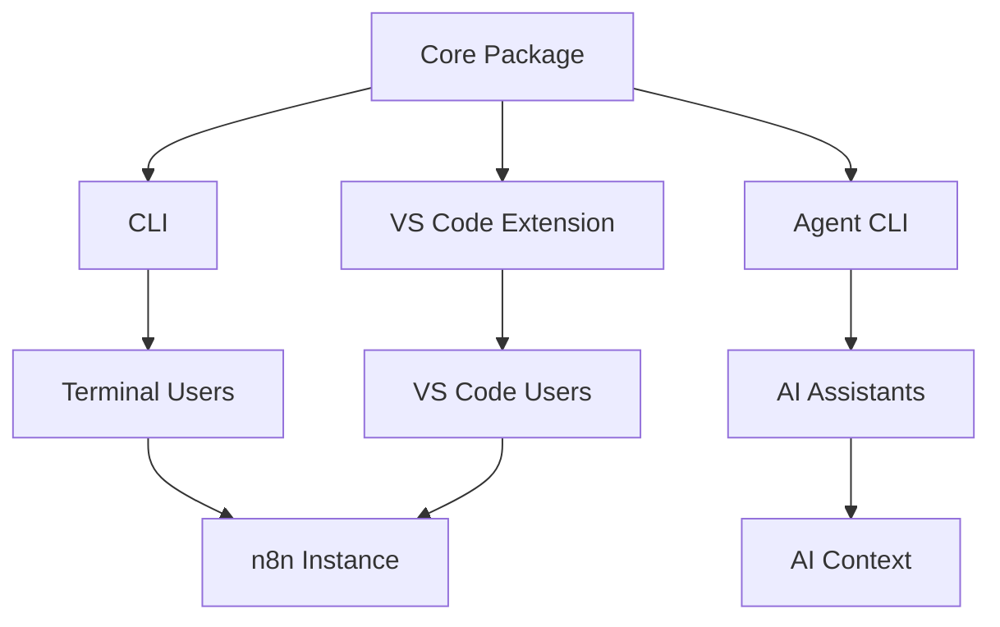

# Welcome to n8n-as-code

**n8n-as-code** is an ecosystem designed to manage your n8n workflows as code. It transforms your automations into synchronized local JSON files, enabling version control (Git), AI-assisted editing, and seamless integration into VS Code.

## 🚀 What is n8n-as-code?

n8n-as-code bridges the gap between visual workflow automation and software engineering best practices. It provides:

- **Version Control**: Leverage the ability for you to version your workflows with Git
- **AI Assistance**: Get intelligent suggestions and validation for your workflows
- **Real-time Sync**: Keep your local files and n8n instance in sync
- **VS Code Integration**: Edit workflows directly in your favorite code editor
- **Conflict Resolution**: Smart conflict detection and resolution tools

## 🎯 Key Features

<div className="n8n-feature-grid">

<div className="n8n-card">

### 🔄 Real-time Synchronization or manual push/pull

Keep your workflows synchronized between your local files and n8n instance. Changes made in VS Code are instantly reflected in n8n, and vice versa.
Or if you prefer, you can manually push/pull your workflows.


</div>

<div className="n8n-card">

### 🤖 AI-Powered Assistance
Empower your AI agents with **agent-cli** – a comprehensive toolbelt that provides complete access to documentation for all 525 n8n nodes. This enables AI assistants to discover, understand, and leverage the full n8n ecosystem for intelligent workflow development.

**Key capabilities:**
- **Complete node documentation**: Access detailed documentation for all 525 n8n nodes, including parameters, examples, and best practices
- **Intelligent suggestions**: Receive context-aware recommendations for node connections, parameter values, and workflow patterns
- **Validation**: Automatic detection of common errors and best practice violations before execution
- **Code completion**: Intelligent autocomplete for n8n expressions, node parameters, and JavaScript functions
- **Context awareness**: The system analyzes your entire workflow structure to provide relevant assistance

</div>

<div className="n8n-card">

### 🛡️ Conflict Management
Smart conflict detection prevents data loss. When conflicts occur, you get a visual diff to choose which version to keep.

</div>

<div className="n8n-card">

### 📁 Multi-Instance Support
Work with multiple n8n instances simultaneously. Your workflows are automatically organized by instance to avoid mixing files.

</div>

<div className="n8n-card">

### 🎨 Visual Editing
Edit workflows in a split view: JSON on one side, n8n canvas on the other. See your changes in real-time.

</div>

<div className="n8n-card">

### 🔧 Command Line Interface
Full-featured CLI for automation, scripting, and CI/CD integration. Manage workflows from your terminal.

</div>

</div>

## 🏗️ Architecture Overview

n8n-as-code is built as a monorepo with four main packages:



### Packages

| Package | Purpose | Primary Users |
|---------|---------|---------------|
| **Core** | Shared logic, API client, synchronization | All packages |
| **CLI** | Command-line interface for workflow management | Terminal users, automation |
| **VS Code Extension** | Integrated development environment | VS Code users |
| **Agent CLI** | AI context generation and node schemas | AI assistants, developers |

## 🏁 Quick Start

Ready to get started? Here's how to set up n8n-as-code in under 2 minutes:

1. **Install the CLI**:
   ```bash
   npm install -g @n8n-as-code/cli
   ```

2. **Initialize your project**:
   ```bash
   n8n-as-code init
   ```

3. **Sync your workflows**:
   ```bash
   n8n-as-code pull
   ```

4. **Open in VS Code**:
   Install the n8n-as-code extension and start editing!

For detailed instructions, check out our [Getting Started guide](/docs/getting-started).

## 📚 Documentation Structure

This documentation is organized into several sections:

- **Getting Started**: Installation, configuration, and first steps
- **Usage**: Detailed guides for each package (CLI, VS Code Extension, Agent CLI, Core)
- **Contributors**: Architecture, development setup, and contribution guidelines
- **Troubleshooting**: Common issues and solutions

## 🆕 What's New?

- **Version 0.2.0**: Multi-instance support, improved conflict resolution, enhanced AI context
- **Version 0.1.0**: Initial release with core synchronization, VS Code extension, and CLI

For detailed release information, check the GitHub repository releases.

## 🤝 Get Involved

n8n-as-code is an open-source project. We welcome contributions!

- **Report Issues**: Found a bug? [Open an issue](https://github.com/EtienneLescot/n8n-as-code/issues)
- **Request Features**: Have an idea? [Start a discussion](https://github.com/EtienneLescot/n8n-as-code/discussions)
- **Contribute Code**: Check out our [Contributor Guide](/docs/contributors)

## 📞 Need Help?

- **Documentation**: Browse the sections below for detailed guides
- **GitHub**: Check [existing issues](https://github.com/EtienneLescot/n8n-as-code/issues) or start a discussion
- **Community**: Join the n8n community for broader automation discussions

---

*Last updated: January 2026*
