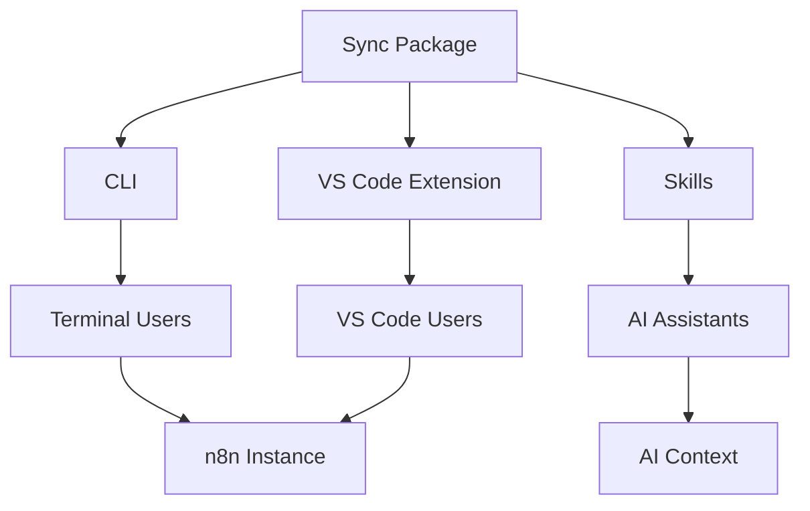

# Welcome to n8n-as-code

**n8n-as-code** is an ecosystem designed to manage your n8n workflows as code. It transforms your automations into synchronized local JSON files, enabling version control (Git), AI-assisted editing, and seamless integration into VS Code.

## 🚀 What is n8n-as-code?

n8n-as-code bridges the gap between visual workflow automation and software engineering best practices. It provides:

- **Version Control**: Leverage the ability for you to version your workflows with Git
- **AI Agent Support**: Empower AI coding assistants with complete n8n node documentation and schemas
- **Real-time Sync**: Keep your local files and n8n instance in sync with 3-way merge detection
- **VS Code Integration**: Edit workflows directly in your favorite code editor with visual status indicators
- **Smart Conflict Resolution**: Deterministic 3-way merge prevents false conflicts with persistent resolution UI

## 🎯 Key Features

<div className="n8n-feature-grid">

<div className="n8n-card">

### 🔄 Real-time Synchronization with 3-Way Merge

Keep your workflows synchronized between your local files and n8n instance using a robust **3-way merge architecture**:
- **Watcher** observes file system and API changes passively
- **3-way comparison** (base vs local vs remote) detects true conflicts
- **Deterministic detection** eliminates false positive conflicts
- Changes made in VS Code are instantly reflected in n8n, and vice versa
- Manual push/pull commands available for more control


</div>

<div className="n8n-card">

### 🤖 AI Agent Empowerment
Empower your AI coding assistants with **Skills** (`@n8n-as-code/skills`) – a toolkit that provides complete documentation, schemas, and context for all 525 n8n nodes. This enables AI assistants to understand the n8n ecosystem and provide intelligent workflow development support.

**Key capabilities:**
- **Complete node documentation**: Structured schemas and documentation for all n8n nodes
- **Context generation**: Rich context files for AI assistants to understand your workflow structure
- **Snippet libraries**: Pre-built code snippets for common automation scenarios
- **Schema validation**: JSON schemas for workflow validation and error prevention

</div>

<div className="n8n-card">

### 🛡️ Smart Conflict Resolution
Deterministic 3-way merge detection prevents false conflicts. When real conflicts occur:
- **Visual diff** shows differences between local and remote versions
- **Persistent UI** in VS Code tree view with expandable action buttons
- **Interactive CLI prompts** for conflict resolution
- **Automatic backups** before destructive operations

</div>

<div className="n8n-card">

### 📁 Multi-Instance Support
Work with multiple n8n instances simultaneously. Your workflows are automatically organized by instance to avoid mixing files.

</div>

<div className="n8n-card">

### 🎨 Visual Editing
Edit workflows in a split view: JSON on one side, n8n canvas on the other. See your changes in real-time.

</div>

<div className="n8n-card">

### 🔧 Command Line Interface
Full-featured CLI for automation, scripting, and CI/CD integration. Manage workflows from your terminal.

</div>

</div>

## 🏗️ Architecture Overview

n8n-as-code is built as a monorepo with four main packages:



### Packages

| Package | Purpose | Primary Users |
|---------|---------|---------------|
| **Sync** | Shared logic, API client, synchronization | All packages |
| **CLI** | Command-line interface for workflow management | Terminal users, automation |
| **VS Code Extension** | Integrated development environment | VS Code users |
| **Skills** | AI context generation & node schemas (formerly Skills CLI) | AI assistants, developers |

## 🏁 Quick Start

Ready to get started? Here's how to set up n8n-as-code in under 2 minutes:

1. **Install the CLI**:
   ```bash
   npm install -g @n8n-as-code/cli
   ```

2. **Initialize your project**:
   ```bash
   n8nac init
   ```

   You'll be prompted to select which **n8n project** to sync.

3. **Sync your workflows**:
   ```bash
   n8nac pull
   ```

4. **Open in VS Code**:
   Install the n8n-as-code extension and start editing!

For detailed instructions, check out our [Getting Started guide](/docs/getting-started).

## 📚 Documentation Structure

This documentation is organized into several sections:

- **Getting Started**: Installation, configuration, and first steps
- **Usage**: Detailed guides for each package (CLI, VS Code Extension, Skills, Sync)
- **Contribution**: Architecture, development setup, and contribution guidelines
- **Troubleshooting**: Common issues and solutions

## 🆕 What's New?

- **Rebranding**: Renamed CLI to `n8nac` and `skills` to `skills` for better developer experience
- **Major Refactor (Latest)**: 3-way merge architecture for reliable conflict detection
  - New CLI commands: `start` (replaces `watch`) and `list` for status overview
   - Project-scoped sync: one selected project at a time (`init` / `switch`)
  - Persistent conflict resolution UI in VS Code with expandable action buttons
  - Visual status indicators (color-coded icons) in tree view
  - Enhanced synchronization reliability with atomic operations and backups
  - Separated state observation (Watcher) from state mutation (SyncEngine)
- **Version 0.2.0**: Multi-instance support, improved conflict resolution, enhanced AI context
- **Version 0.1.0**: Initial release with sync synchronization, VS Code extension, and CLI

For detailed release information, check the GitHub repository releases.

## 🤝 Get Involved

n8n-as-code is an open-source project. We welcome contributions!

- **Report Issues**: Found a bug? [Open an issue](https://github.com/EtienneLescot/n8n-as-code/issues)
- **Request Features**: Have an idea? [Start a discussion](https://github.com/EtienneLescot/n8n-as-code/discussions)
- **Contribute Code**: Check out our [Contribution Guide](/docs/contribution)

## 📞 Need Help?

- **Documentation**: Browse the sections below for detailed guides
- **GitHub**: Check [existing issues](https://github.com/EtienneLescot/n8n-as-code/issues) or start a discussion
- **Community**: Join the n8n community for broader automation discussions

---

*Last updated: January 2026*
