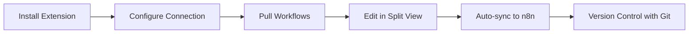
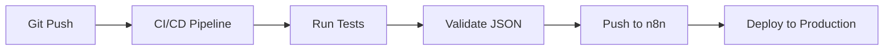

# Usage Guides

Welcome to the n8n-as-code usage guides. This section provides detailed instructions for using the primary tools in the n8n-as-code ecosystem.

## 🎯 What You'll Find Here

This section is organized by the primary user-facing tools:

| Tool | Purpose | Best For |
|------|---------|----------|
| **[VS Code Extension](/docs/usage/vscode-extension)** | Integrated development environment | Visual editing, real-time sync, workflow validation |
| **[CLI](/docs/usage/cli)** | Command-line interface | Automation, scripting, CI/CD integration |
| **[Agent CLI](/docs/usage/agent-cli)** | AI tools and node schemas | AI coding assistants, node search, schema retrieval |
| **[Claude Skill](/docs/usage/claude-skill)** | Claude Agent Skill package | Using Claude AI to generate n8n workflows |

## 🎨 Choosing the Right Tool

### For Visual Workflow Editing (Recommended)
Use the **VS Code Extension** if you:
- Prefer a visual interface with split-view editing
- Want real-time synchronization as you type
- Need workflow validation and schema checking
- Work primarily in VS Code for development
- Want to see n8n canvas preview while editing JSON

### For Automation and Scripting
Use the **CLI** if you:
- Need to automate workflow management tasks
- Want to integrate with CI/CD pipelines
- Prefer working in the terminal
- Need to script bulk operations
- Want to run n8n-as-code in headless environments

## 🔄 Common Workflows

### Basic Workflow Management with VS Code



### Automation Pipeline with CLI



## 🛠️ Integration Examples

### VS Code + Git Integration

1. **Edit workflows** in VS Code with real-time sync
2. **Commit changes** to Git for version control
3. **Review changes** using Git diff
4. **Collaborate** with team members via Git
5. **Deploy** using CI/CD pipelines

### CLI + Automation Scripts

```bash
#!/bin/bash
# Example automation script for CI/CD

# Pull workflows from source instance
n8n-as-code pull

# Validate JSON syntax (using jq or other tools)
find workflows/ -name "*.json" -exec jq . {} >/dev/null 2>&1 \;

# Push to target environment
export N8N_HOST="https://target.n8n.example.com"
export N8N_API_KEY="$TARGET_API_KEY"
n8n-as-code init
n8n-as-code push
```

## 📚 Quick Reference

### Common Commands

| Command | Description | Tool |
|---------|-------------|------|
| `n8n-as-code init` | Initialize project configuration | CLI |
| `n8n-as-code pull` | Download workflows from n8n | CLI |
| `n8n-as-code push` | Upload workflows to n8n | CLI |
| `n8n-as-code watch` | Real-time sync mode | CLI |
| `n8n-as-code init-ai` | Generate AI context files | CLI |
| `npx @n8n-as-code/agent-cli search` | Search for n8n nodes | Agent CLI |
| `npx @n8n-as-code/agent-cli get` | Get node JSON schema | Agent CLI |
| `npx @n8n-as-code/agent-cli list` | List all available nodes | Agent CLI |
| VS Code: Refresh button | Pull workflows | Extension |
| VS Code: Save file | Auto-push to n8n | Extension |

### Configuration Files

| File | Purpose | Location |
|------|---------|----------|
| `n8n-as-code.json` | Project settings | Project root |
| VS Code Settings | Connection config | VS Code settings |

## 🚀 Getting Started with Each Tool

### 1. VS Code Extension (Recommended)
1. Install from VS Code Marketplace
2. Configure connection in extension settings
3. Open workflow tree view from Activity Bar
4. Start editing with auto-sync enabled

### 2. CLI
1. Install globally: `npm install -g @n8n-as-code/cli`
2. Initialize: `n8n-as-code init`
3. Sync workflows: `n8n-as-code pull`
4. Use commands as needed for automation

### 3. Agent CLI (For AI Tools)
1. Run with npx: `npx @n8n-as-code/agent-cli --help`
2. Search for nodes: `npx @n8n-as-code/agent-cli search "query"`
3. Get node schemas: `npx @n8n-as-code/agent-cli get nodeName`
4. Use output for AI context or development

### 4. Claude Skill (For Claude AI)
1. Build: `cd packages/claude-skill && npm run build`
2. Install to Claude.ai, Claude Code, or use via API
3. Claude automatically uses the skill for n8n questions
4. See [Claude Skill Guide](/docs/usage/claude-skill) for details

## 🔧 Advanced Features

### Multi-Instance Management
Work with multiple n8n instances. Workflows are automatically organized by instance to avoid mixing files from different environments.

### Real-time Sync
Changes made in VS Code are instantly reflected in n8n, and vice versa. No manual push/pull required when using watch mode.

### Git Integration
Store workflows as JSON files in Git for version control, collaboration, and deployment pipelines.

### AI Assistant Support
Generate context files that help AI coding assistants understand n8n workflow structure and provide accurate suggestions.

## 📖 Next Steps

Explore the specific guides for each tool:

- **[VS Code Extension Guide](/docs/usage/vscode-extension)**: Learn about visual editing, real-time sync, and advanced features
- **[CLI Guide](/docs/usage/cli)**: Master command-line usage, automation, and scripting
- **[Agent CLI Guide](/docs/usage/agent-cli)**: Use AI tools for node search and schema retrieval

## 🔍 Internal Components

For information about internal components used by developers and AI assistants, see:

- **[Contribution Guide](/docs/contribution)**: Architecture, development setup, and internal packages
- **[API Reference](/api/index.html)**: Developer documentation for all packages

## 🆘 Troubleshooting

Common issues and solutions:

- **Connection issues**: Check n8n URL and API key
- **File permission errors**: Check file and directory permissions
- **Extension not working**: Restart VS Code or reinstall extension

For more help, check the [Troubleshooting guide](/docs/troubleshooting) or [open an issue](https://github.com/EtienneLescot/n8n-as-code/issues).

---

*Ready to dive deeper? Choose a tool below to get started with detailed guides.*
