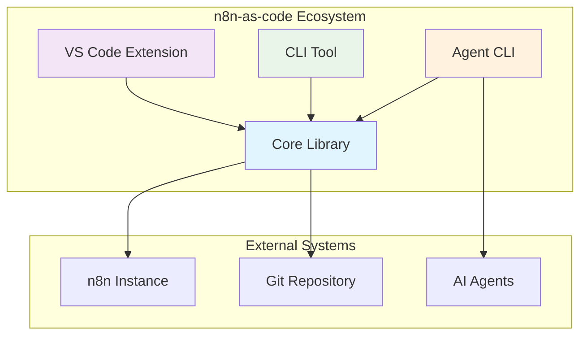
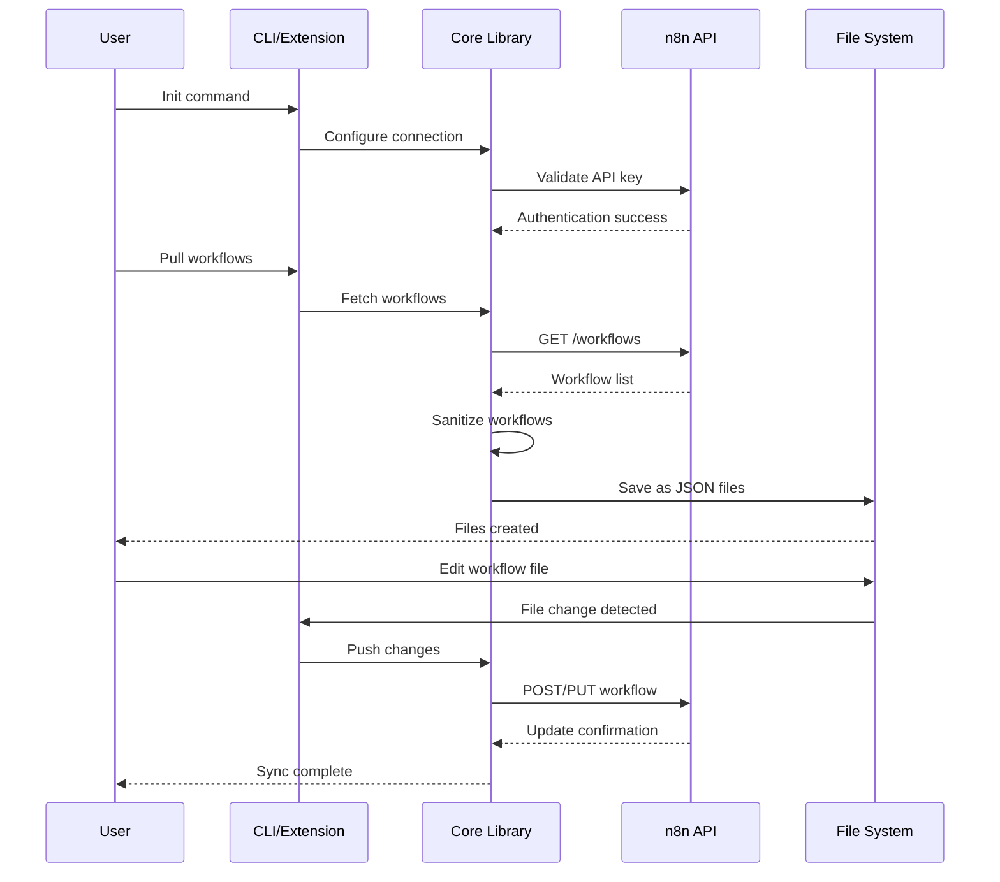
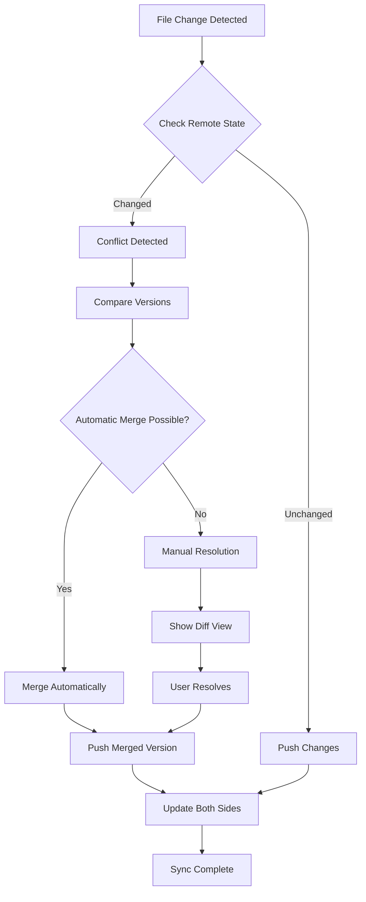
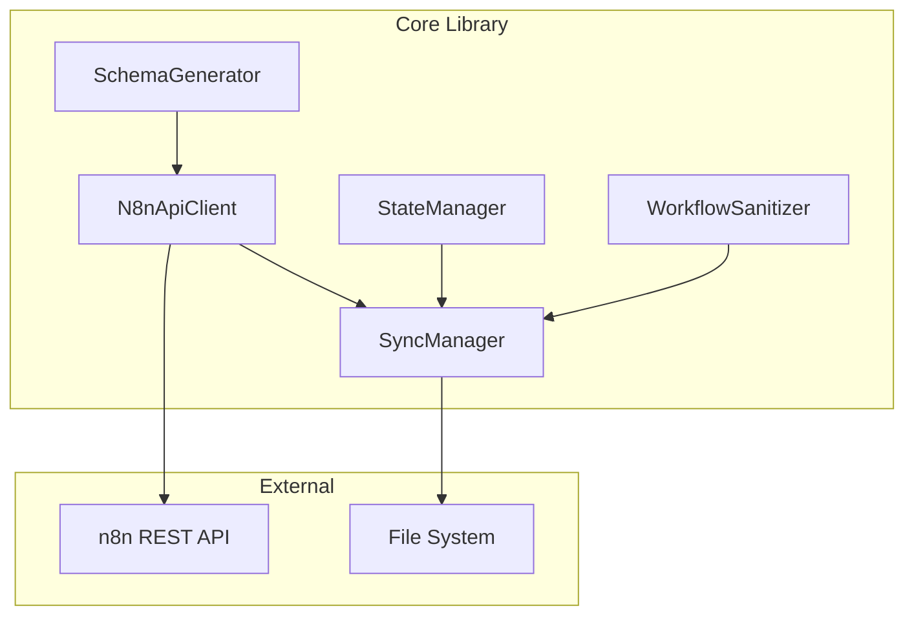
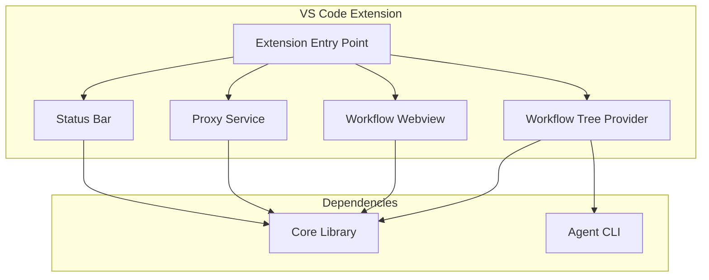
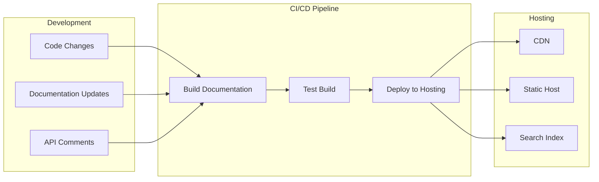
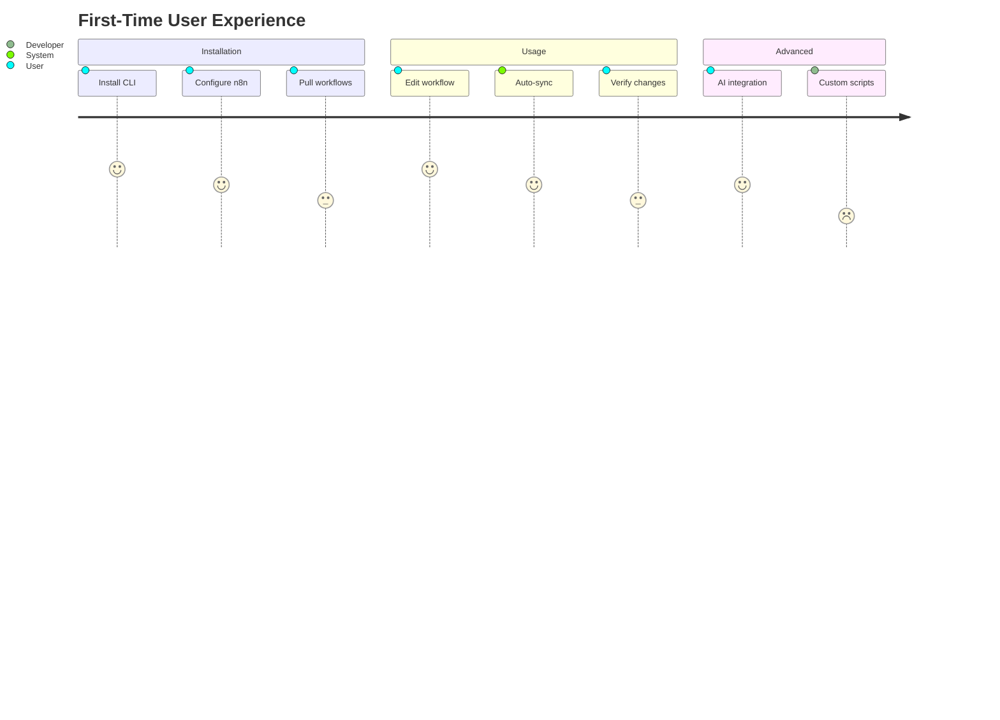

# Architecture Diagrams and Visual Documentation

## Overview
Visual documentation plan for n8n-as-code monorepo using Mermaid.js diagrams embedded in Docusaurus documentation.

## 1. System Architecture Diagrams

### 1.1 High-Level System Overview


### 1.2 Monorepo Package Relationships
```mermaid
graph LR
    subgraph "Monorepo Packages"
        Core[@n8n-as-code/core]
        CLI[@n8n-as-code/cli]
        AgentCLI[@n8n-as-code/agent-cli]
        VSCodeExt[VS Code Extension]
    end
    
    CLI --> Core
    AgentCLI --> Core
    VSCodeExt --> Core
    VSCodeExt --> AgentCLI
    
    style Core fill:#bbdefb
```

## 2. Data Flow Diagrams

### 2.1 Workflow Synchronization Flow


### 2.2 Conflict Resolution Process


## 3. Component Diagrams

### 3.1 Core Library Components


### 3.2 VS Code Extension Architecture


## 4. Deployment Architecture

### 4.1 Documentation Deployment Pipeline


## 5. User Journey Maps

### 5.1 First-Time User Journey


## 6. Diagram Implementation Strategy

### 6.1 Mermaid.js Integration
- Use Docusaurus Mermaid plugin
- Embed diagrams in Markdown files
- Ensure proper rendering in dark/light themes

### 6.2 Diagram Locations
1. **Home Page**: System overview diagram
2. **Getting Started**: User journey map
3. **Architecture**: Component and data flow diagrams
4. **Contributor Guide**: Monorepo structure diagram
5. **API Reference**: Package relationship diagram

### 6.3 Maintenance Plan
- Keep diagrams updated with code changes
- Version diagrams alongside features
- Include diagram updates in PR checklist

## 7. Interactive Diagrams (Future Enhancement)

### 7.1 Potential Interactive Elements
- Clickable architecture diagrams
- Animated data flow demonstrations
- Interactive API explorer
- Live configuration examples

### 7.2 Implementation Technologies
- React components for interactivity
- D3.js for advanced visualizations
- Custom Docusaurus components
- Integration with TypeDoc output

## 8. Visual Design Guidelines

### 8.1 Color Scheme
- **Core Library**: Light blue (#bbdefb)
- **CLI**: Light green (#e8f5e8)
- **Agent CLI**: Light orange (#fff3e0)
- **VS Code Extension**: Light purple (#f3e5f5)
- **External Systems**: Light gray (#f5f5f5)

### 8.2 Diagram Standards
- Consistent node shapes
- Clear labeling
- Appropriate abstraction levels
- Mobile-responsive sizing
- Accessible color contrasts

## 9. Quality Assurance

### 9.1 Validation Checklist
- [ ] All diagrams render correctly
- [ ] Colors are accessible
- [ ] Labels are accurate
- [ ] Flow is logically correct
- [ ] Diagrams match current architecture
- [ ] Mobile responsiveness tested

### 9.2 Update Process
1. Review diagrams during architecture changes
2. Update diagrams before releases
3. Validate with code reviewers
4. Test rendering in documentation build