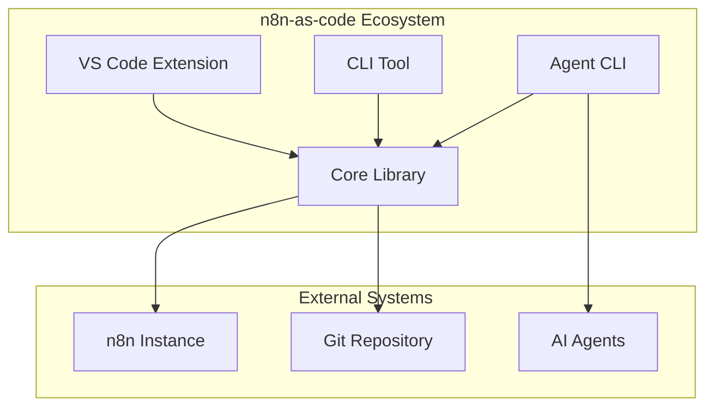

# Content Outline for Documentation Sections

## Overview
Detailed content plan for Home, Getting Started, and Usage sections of the n8n-as-code documentation.

## 1. Home Section

### 1.1 Home Page (`docs/home/index.md`)
```markdown
---
title: n8n-as-code
description: Manage n8n workflows as code with version control and AI assistance
---

# 🚀 n8n-as-code

**Transform your n8n automations into version-controlled code with AI-powered editing.**

## ✨ Why n8n-as-code?

n8n-as-code bridges the gap between visual automation and code-first development:

- **📁 Version Control**: Store workflows as JSON files in Git
- **🤖 AI Assistance**: Get intelligent suggestions and auto-completion
- **🔀 Real-time Sync**: Bi-directional synchronization with n8n
- **💻 Developer Experience**: Full VS Code integration
- **🛡️ Conflict Resolution**: Smart merge capabilities

## 🎯 Key Features

### VS Code Integration
- Activity bar with workflow explorer
- Embedded n8n board viewer
- Split-view editing (JSON + Visual)
- Auto-sync on save

### CLI Power
- Command-line workflow management
- Batch operations
- Scripting and automation
- CI/CD integration

### AI Superpowers
- Context-aware code generation
- Node schema intelligence
- Smart snippet suggestions
- Error prevention

### Enterprise Ready
- Multi-environment support
- Conflict detection and resolution
- Audit trails
- Team collaboration

## 🏗️ Architecture



## 🚀 Quick Start

Get started in under 2 minutes:

```bash
# Install and build
npm install && npm run build
npm link

# Configure
n8n-as-code init

# Sync workflows
n8n-as-code pull
```

[Get Started →](/docs/getting-started/installation)

## 📦 Packages

| Package | Description | Use Case |
|---------|-------------|----------|
| **VS Code Extension** | Visual workflow management | Daily development |
| **CLI Tool** | Command-line interface | Automation & scripting |
| **Agent CLI** | AI context generation | AI-assisted development |
| **Core Library** | Synchronization engine | Custom integrations |

## 🤝 Community & Support

- [GitHub Repository](https://github.com/EtienneLescot/n8n-as-code)
- [Issue Tracker](https://github.com/EtienneLescot/n8n-as-code/issues)
- [Discussions](https://github.com/EtienneLescot/n8n-as-code/discussions)
- [n8n Community](https://community.n8n.io)

## 📄 License

MIT License - see [LICENSE](https://github.com/EtienneLescot/n8n-as-code/blob/main/LICENSE)
```

## 2. Getting Started Section

### 2.1 Installation (`docs/getting-started/installation.md`)
```markdown
---
title: Installation
description: Install n8n-as-code on your system
---

# Installation Guide

## Prerequisites

- **Node.js**: Version 18 or higher
- **npm**: Version 9 or higher
- **n8n Instance**: Running n8n instance with API access
- **Git**: For version control (optional but recommended)

## Installation Methods

### Method 1: Global Installation (Recommended)

```bash
# Clone the repository
git clone https://github.com/EtienneLescot/n8n-as-code.git
cd n8n-as-code

# Install dependencies and build
npm install
npm run build

# Link CLI globally
npm link
```

### Method 2: Development Installation

```bash
# Clone and setup
git clone https://github.com/EtienneLescot/n8n-as-code.git
cd n8n-as-code

# Install all dependencies
npm install

# Build all packages
npm run build

# Install VS Code extension locally
npm run extension:install
```

### Method 3: Package Installation (Future)

```bash
# When packages are published to npm
npm install -g @n8n-as-code/cli
```

## Verification

Verify installation by checking the CLI version:

```bash
n8n-as-code --version
```

Expected output:
```
@n8n-as-code/cli 0.2.0
```

## Next Steps

1. [Configure your n8n instance →](/docs/getting-started/configuration)
2. [Perform your first sync →](/docs/getting-started/first-sync)
3. [Set up VS Code extension →](/docs/getting-started/vscode-setup)
```

### 2.2 Configuration (`docs/getting-started/configuration.md`)
```markdown
---
title: Configuration
description: Configure n8n-as-code with your n8n instance
---

# Configuration Guide

## Interactive Configuration

The easiest way to configure n8n-as-code is using the interactive `init` command:

```bash
n8n-as-code init
```

This will guide you through:
1. **n8n Host URL**: Your n8n instance address
2. **API Key**: n8n API key for authentication
3. **Sync Directory**: Local folder for workflow storage
4. **Sync Mode**: Auto or manual synchronization

## Configuration Files

n8n-as-code creates two configuration files:

### 1. Project Configuration (`n8n-as-code.json`)
```json
{
  "host": "https://n8n.example.com",
  "syncFolder": "workflows",
  "syncMode": "auto",
  "pollInterval": 3000
}
```

### 2. Instance Configuration (Global Storage)
Stored in your system's configuration directory:
- Linux: `~/.config/n8n-as-code/instances.json`
- macOS: `~/Library/Preferences/n8n-as-code/instances.json`
- Windows: `%APPDATA%/n8n-as-code/instances.json`

## Environment Variables

For CI/CD or advanced setups, use environment variables:

```bash
export N8N_HOST="https://n8n.example.com"
export N8N_API_KEY="your-api-key-here"
export N8N_SYNC_FOLDER="workflows"
```

## Multiple Environments

Configure different environments:

```bash
# Development environment
n8n-as-code init --env development

# Production environment  
n8n-as-code init --env production

# Use specific environment
n8n-as-code pull --env production
```

## Security Considerations

- API keys are stored in system keychain/secure storage
- Never commit `instances.json` to version control
- Use different API keys for different environments
- Regularly rotate API keys

## Troubleshooting

**Issue**: "Unable to connect to n8n instance"
- Verify n8n is running and accessible
- Check API key permissions
- Ensure CORS is configured on n8n

**Issue**: "Permission denied" for sync folder
- Create the folder manually
- Check write permissions
- Use absolute path in configuration
```

### 2.3 First Sync (`docs/getting-started/first-sync.md`)
```markdown
---
title: First Sync
description: Perform your first workflow synchronization
---

# First Synchronization

## Pull Workflows from n8n

Download all workflows from your n8n instance:

```bash
n8n-as-code pull
```

This will:
1. Fetch all workflows from n8n
2. Sanitize them (remove IDs, timestamps)
3. Save as JSON files in your sync folder
4. Create a local state file for tracking

## File Structure

After pulling, your sync folder will contain:

```
workflows/
├── workflow-1.json
├── workflow-2.json
├── workflow-3.json
└── .n8n-state.json
```

## View Local Workflows

List downloaded workflows:

```bash
# Using CLI
n8n-as-code list

# Or check file system
ls -la workflows/
```

## Edit a Workflow

1. Open a workflow file in your editor:
   ```bash
   code workflows/workflow-1.json
   ```

2. Make changes to the JSON

3. Save the file

## Push Changes Back

Sync your changes to n8n:

```bash
n8n-as-code push
```

Or enable auto-sync:

```bash
n8n-as-code watch
```

## Verify Synchronization

Check sync status:

```bash
# View sync status
n8n-as-code status

# See what would be synced (dry run)
n8n-as-code push --dry-run
```

## Common First Sync Scenarios

### Scenario 1: Empty n8n instance
- No workflows will be downloaded
- You can create new workflows locally
- Push to create them in n8n

### Scenario 2: Existing workflows
- All workflows downloaded
- Local files match n8n state
- Ready for editing

### Scenario 3: Partial sync
- Use filters to sync specific workflows
- ```bash
  n8n-as-code pull --filter "marketing"
  ```

## Next Steps

- [Set up VS Code extension for better editing →](/docs/getting-started/vscode-setup)
- [Learn about advanced sync features →](/docs/usage/cli/advanced-usage)
- [Configure AI assistance →](/docs/usage/agent-cli/ai-integration)
```

### 2.4 VS Code Setup (`docs/getting-started/vscode-setup.md`)
```markdown
---
title: VS Code Setup
description: Install and configure the VS Code extension
---

# VS Code Extension Setup

## Installation

### Method 1: Local Development Build (Recommended)

From the n8n-as-code repository:

```bash
# Build and install the extension
npm run extension:install
```

This will:
1. Build the VS Code extension
2. Package it as a VSIX file
3. Install it in your VS Code instance

### Method 2: Manual Installation (Future)

When published to VS Code Marketplace:

1. Open VS Code
2. Go to Extensions (Ctrl+Shift+X)
3. Search for "n8n as code"
4. Click Install

## Configuration

### Extension Settings

Open VS Code settings (Ctrl+,) and configure:

```json
{
  "n8n.host": "https://n8n.example.com",
  "n8n.apiKey": "your-api-key",
  "n8n.syncFolder": "workflows",
  "n8n.syncMode": "auto",
  "n8n.pollInterval": 3000
}
```

### Project Setup

1. Open your project folder in VS Code
2. Ensure `n8n-as-code.json` exists at root
3. The extension will auto-detect configuration

## Features Overview

### Activity Bar
- **n8n Icon**: Access workflows panel
- **Workflow List**: All synchronized workflows
- **Status Indicators**: Sync status per workflow

### Commands Palette
- `n8n: Pull Workflows`: Download from n8n
- `n8n: Push Workflows`: Upload to n8n
- `n8n: Open Board`: Visual workflow editor
- `n8n: Initialize AI`: Generate AI context

### Context Menu
Right-click on workflow files for:
- Open in n8n board
- Push individual workflow
- Pull individual workflow
- Open split view

## First Use

1. **Initialize AI Context** (Recommended):
   - Click the sparkle icon in n8n panel
   - Or run `n8n: Initialize AI` command

2. **Pull Workflows**:
   - Click download icon in n8n panel
   - Or run `n8n: Pull Workflows` command

3. **Edit Workflow**:
   - Double-click workflow in panel
   - Edit JSON on left, view visual on right
   - Auto-sync on save (if in auto mode)

## Troubleshooting

**Extension not appearing**:
- Restart VS Code
- Check extension is installed: `code --list-extensions | grep n8n`
- Rebuild and reinstall: `npm run extension:install`

**Connection errors**:
- Verify n8n host is accessible
- Check API key in settings
- Ensure CORS is enabled on n8n

**Sync issues**:
- Check sync folder permissions
- Verify `.n8n-state.json` exists
- Check for merge conflicts

## Advanced Configuration

### Custom Themes
```json
{
  "n8n.theme": "dark",
  "n8n.boardZoom": 0.8,
  "n8n.showMiniMap": true
}
```

### Keyboard Shortcuts
Add to `keybindings.json`:
```json
[
  {
    "key": "ctrl+shift+n p",
    "command": "n8n.pull"
  },
  {
    "key": "ctrl+shift+n u", 
    "command": "n8n.push"
  }
]
```

## Next Steps

- [Learn about VS Code extension features →](/docs/usage/vscode-extension/features)
- [Explore AI integration →](/docs/usage/vscode-extension/ai-integration)
- [Troubleshooting guide →](/docs/usage/vscode-extension/troubleshooting)
```

## 3. Usage Section Structure

### 3.1 VS Code Extension Usage
- `usage/vscode-extension/features.md` - Detailed feature overview
- `usage/vscode-extension/workflow-management.md` - Workflow editing and management
- `usage/vscode-extension/ai-integration.md` - AI features and configuration
- `usage/vscode-extension/troubleshooting.md` - Common issues and solutions

### 3.2 CLI Tool Usage  
- `usage/cli/commands.md` - Complete command reference
- `usage/cli/configuration.md` - Advanced configuration options
- `usage/cli/advanced-usage.md` - Scripting, automation, CI/CD
- `usage/cli/troubleshooting.md` - CLI-specific issues

### 3.3 Agent CLI Usage
- `usage/agent-cli/purpose.md` - Overview and use cases
- `usage/agent-cli/ai-integration.md` - How AI agents use it
- `usage/agent-cli/development-tools.md` - Integration with development tools

### 3.4 Core Library Usage
- `usage/core/overview.md` - Library architecture and concepts
- `usage/core/integration.md` - How to integrate in custom projects
- `usage/core/advanced.md` - Advanced usage patterns

## 4. Content Creation Guidelines

### 4.1 Writing Standards
- Use active voice
- Include practical examples
- Add code snippets with explanations
- Include screenshots for UI features
- Add troubleshooting sections

### 4.2 Example Format
```markdown
## Section Title

Brief introduction explaining the concept.

### Example

```bash
# Command example with comments
n8n-as-code command --option value
```

### Explanation

Detailed explanation of what the example does.

### Common Use Cases

- Use case 1: Description
- Use case 2: Description

### Troubleshooting

**Issue**: Description of issue
**Solution**: Step-by-step solution
```

### 4.3 Review Checklist
- [ ] Technical accuracy verified
- [ ] Examples tested
- [ ] Screenshots up-to-date
- [ ] Links working
- [ ] SEO keywords included
- [ ] Mobile readability checked

## 5. Content Migration Plan

### 5.1 Existing Content to Migrate
1. Root README.md → Home page
2. Package READMEs → Respective usage sections
3. CLI help text → Command reference
4. AGENTS.md → Contributor guide + AI integration

### 5.2 New Content to Create
1. Step-by-step tutorials
2. Video tutorials (future)
3. Interactive examples
4. API usage examples
5. Best practices guide
6. Performance optimization guide

## 6. Content Maintenance

### 6.1 Update Schedule
- Review monthly for accuracy
- Update with each major release
- Validate examples with new versions
- Update screenshots for UI changes

### 6.2 Contribution Process
- Markdown files in `/docs` directory
- PR review required
- Automated validation
- Preview builds for review