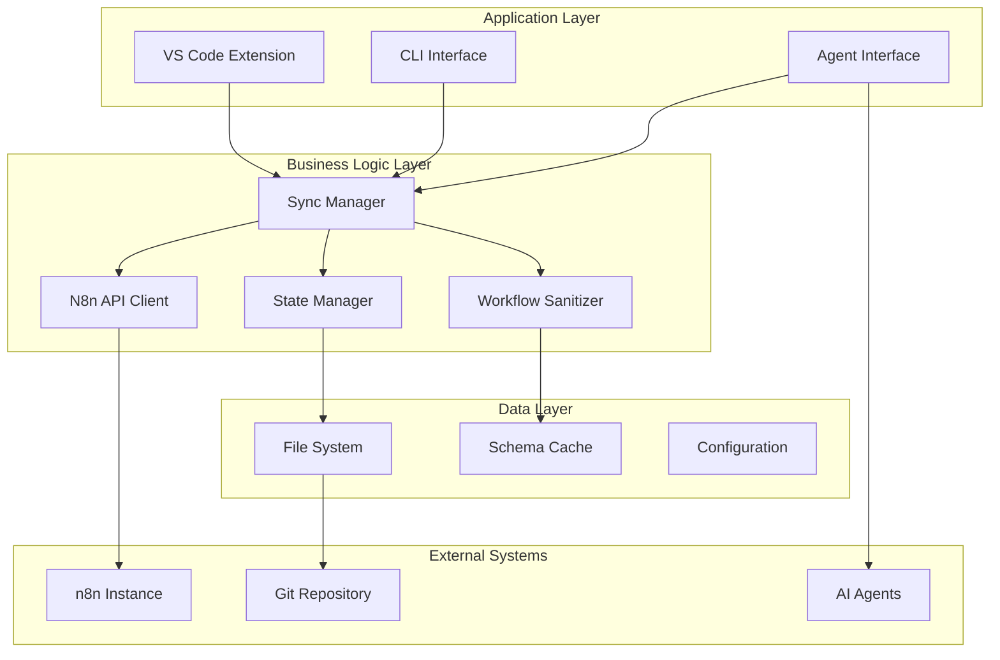
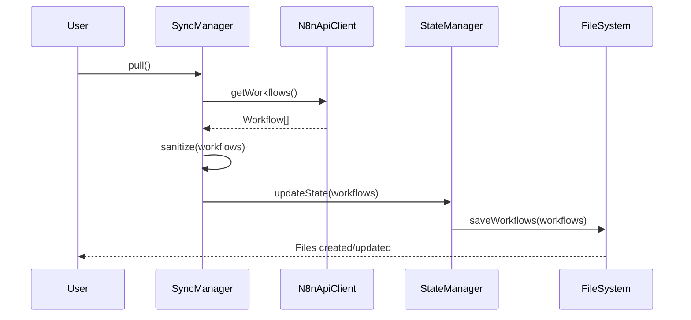
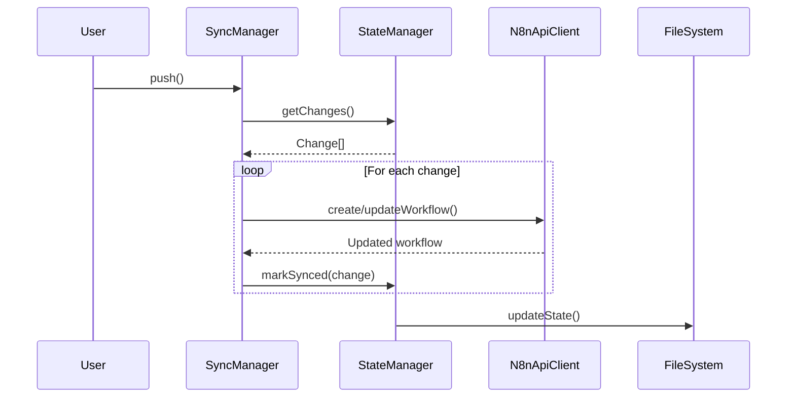

# Contributor Documentation and Architecture Guides

## Overview
Comprehensive documentation for developers contributing to n8n-as-code, including architecture guides, development setup, and contribution guidelines.

## 1. Monorepo Overview (`docs/contributors/monorepo-overview.md`)

```markdown
---
title: Monorepo Overview
description: Understanding the n8n-as-code monorepo structure and package relationships
---

# Monorepo Architecture

## Repository Structure

```
n8n-as-code/
├── packages/                 # All packages
│   ├── core/                # Core library
│   ├── cli/                 # CLI tool
│   ├── agent-cli/           # Agent CLI tools
│   └── vscode-extension/    # VS Code extension
├── scripts/                 # Build and utility scripts
├── docs/                    # Documentation site
├── plans/                   # Project planning documents
└── .github/                 # GitHub workflows
```

## Package Relationships

```mermaid
graph TB
    subgraph "Monorepo Packages"
        Core[@n8n-as-code/core]
        CLI[@n8n-as-code/cli]
        AgentCLI[@n8n-as-code/agent-cli]
        VSCodeExt[VS Code Extension]
    end
    
    CLI --> Core
    AgentCLI --> Core
    VSCodeExt --> Core
    VSCodeExt --> AgentCLI
    
    style Core fill:#bbdefb
```

### Package Descriptions

| Package | Purpose | Dependencies |
|---------|---------|--------------|
| **@n8n-as-code/core** | Core synchronization logic, API client, state management | None (external only) |
| **@n8n-as-code/cli** | Command-line interface for workflow management | Core |
| **@n8n-as-code/agent-cli** | AI agent tools and context generation | Core |
| **VS Code Extension** | Visual Studio Code integration | Core, Agent CLI |

## Development Workflow

### Workspace Management
- Uses npm workspaces
- Shared dependencies in root `package.json`
- Package-specific dependencies in each package

### Build Process
```bash
# Build all packages
npm run build

# Build specific package
npm run build:core
npm run build:cli
npm run build:extension
```

### Testing
```bash
# Run all tests
npm test

# Run specific package tests
cd packages/core && npm test
```

## Version Management

### Changesets
The project uses [Changesets](https://github.com/changesets/changesets) for version management:

```bash
# Create a changeset
npm run changeset

# Version packages
npm run version-packages

# Publish release
npm run release
```

### Version Synchronization
- All packages versioned together
- Independent versioning possible but not recommended
- Use `changeset` for coordinated releases

## Code Organization

### Shared Code
- Type definitions in `packages/core/src/types.ts`
- Shared utilities in `packages/core/src/services/`
- Configuration schemas in respective packages

### Package Boundaries
- Clear separation of concerns
- Minimal cross-package dependencies
- Well-defined public APIs

## Tooling

### Development Tools
- **TypeScript**: Type safety across all packages
- **Jest**: Testing framework
- **ESLint**: Code linting (to be implemented)
- **Prettier**: Code formatting (to be implemented)

### Build Tools
- **TypeScript Project References**: Incremental builds
- **esbuild**: VS Code extension bundling
- **tsup**: Potential future bundler

## Next Steps

- [Set up development environment →](/docs/contributors/development-setup)
- [Learn about architecture →](/docs/contributors/architecture)
- [Contribution guidelines →](/docs/contributors/contributing-guide)
```

## 2. Development Setup (`docs/contributors/development-setup.md`)

```markdown
---
title: Development Setup
description: Set up your development environment for contributing to n8n-as-code
---

# Development Environment Setup

## Prerequisites

### Required Software
- **Node.js**: Version 18 or higher
- **npm**: Version 9 or higher
- **Git**: Version control
- **VS Code**: Recommended IDE (with extensions)

### Optional but Recommended
- **n8n Instance**: Local or remote for testing
- **Docker**: For isolated testing environments
- **GitHub CLI**: For PR management

## Initial Setup

### 1. Clone Repository
```bash
git clone https://github.com/EtienneLescot/n8n-as-code.git
cd n8n-as-code
```

### 2. Install Dependencies
```bash
npm install
```

### 3. Build Project
```bash
npm run build
```

This will:
- Clone n8n repository for node schema generation
- Build all packages
- Generate necessary assets

### 4. Link CLI (Optional)
```bash
npm link
```

## Development Workflow

### Working on Core Package
```bash
# Navigate to core package
cd packages/core

# Development build (watch mode)
npm run watch

# Run tests
npm test
```

### Working on CLI Package
```bash
cd packages/cli
npm run watch
```

### Working on VS Code Extension
```bash
cd packages/vscode-extension

# Build extension
npm run build

# Install locally for testing
npm run extension:install
```

## Testing

### Unit Tests
```bash
# Run all unit tests
npm test

# Run specific test file
npx tsx --test tests/unit/workflow-sanitizer.test.ts
```

### Integration Tests
Integration tests require a running n8n instance:

1. Create `.env.test` file:
```env
N8N_HOST=http://localhost:5678
N8N_API_KEY=your-test-api-key
```

2. Run integration tests:
```bash
npm run test:integration
```

### Test Coverage
```bash
# Generate coverage report (to be implemented)
npm run test:coverage
```

## Debugging

### VS Code Debug Configuration
Create `.vscode/launch.json`:
```json
{
  "version": "0.2.0",
  "configurations": [
    {
      "type": "node",
      "request": "launch",
      "name": "Debug Core Tests",
      "program": "${workspaceFolder}/packages/core/node_modules/.bin/tsx",
      "args": ["--test", "${file}"],
      "console": "integratedTerminal",
      "internalConsoleOptions": "neverOpen"
    },
    {
      "type": "extensionHost",
      "request": "launch",
      "name": "Debug VS Code Extension",
      "runtimeExecutable": "${execPath}",
      "args": [
        "--extensionDevelopmentPath=${workspaceFolder}/packages/vscode-extension"
      ],
      "outFiles": [
        "${workspaceFolder}/packages/vscode-extension/out/**/*.js"
      ]
    }
  ]
}
```

### CLI Debugging
```bash
# Build with source maps
npm run build:cli -- --sourcemap

# Debug with Node inspector
node --inspect-brk packages/cli/dist/index.js pull
```

## Code Quality Tools

### Linting (To be implemented)
```bash
# Check code style
npm run lint

# Auto-fix issues
npm run lint:fix
```

### Type Checking
```bash
# Type check all packages
npx tsc --build --force
```

### Formatting (To be implemented)
```bash
# Format code
npm run format

# Check formatting
npm run format:check
```

## Common Development Tasks

### Adding a New Package
1. Create directory in `packages/`
2. Copy structure from existing package
3. Update root `package.json` workspaces
4. Add to changeset configuration
5. Update build scripts

### Updating Dependencies
```bash
# Update all dependencies
npm update

# Update specific package
npm update package-name
```

### Regenerating Node Schema
```bash
# Regenerate n8n node index
npm run generate:nodes
```

## Troubleshooting

### Build Issues
**Issue**: "Cannot find module" errors
- Run `npm install` in root
- Delete `node_modules` and `package-lock.json`, then reinstall
- Check workspace configuration

**Issue**: TypeScript compilation errors
- Run `npx tsc --build --force` to see all errors
- Check for missing type definitions

### Test Issues
**Issue**: Integration tests failing
- Verify n8n instance is running
- Check `.env.test` configuration
- Ensure API key has correct permissions

### Extension Issues
**Issue**: Extension not loading in VS Code
- Rebuild with `npm run build` in extension directory
- Reinstall with `npm run extension:install`
- Check VS Code developer console for errors

## Next Steps

- [Learn about system architecture →](/docs/contributors/architecture)
- [Read contribution guidelines →](/docs/contributors/contributing-guide)
- [Understand release process →](/docs/contributors/release-process)
```

## 3. Architecture Guide (`docs/contributors/architecture.md`)

```markdown
---
title: System Architecture
description: Deep dive into n8n-as-code architecture and design decisions
---

# System Architecture

## Overview

n8n-as-code is designed as a modular system with clear separation of concerns:



## Core Components

### 1. N8nApiClient
**Purpose**: Communicate with n8n REST API
**Key Features**:
- Authentication management
- Request/response handling
- Error handling and retries
- Rate limiting

```typescript
interface N8nApiClient {
  getWorkflows(): Promise<Workflow[]>;
  getWorkflow(id: string): Promise<Workflow>;
  createWorkflow(workflow: Workflow): Promise<Workflow>;
  updateWorkflow(id: string, workflow: Workflow): Promise<Workflow>;
  deleteWorkflow(id: string): Promise<void>;
}
```

### 2. SyncManager
**Purpose**: Orchestrate synchronization between local files and n8n
**Key Features**:
- Bi-directional sync
- Conflict detection
- Change tracking
- Batch operations

```typescript
interface SyncManager {
  pull(options?: SyncOptions): Promise<SyncResult>;
  push(options?: SyncOptions): Promise<SyncResult>;
  watch(options?: WatchOptions): Promise<void>;
  resolveConflict(conflict: Conflict): Promise<Resolution>;
}
```

### 3. StateManager
**Purpose**: Track synchronization state
**Key Features**:
- Local state persistence
- Change detection
- Conflict identification
- Audit trail

### 4. WorkflowSanitizer
**Purpose**: Clean workflow JSON for version control
**Key Features**:
- Remove transient data (IDs, timestamps)
- Normalize formatting
- Validate structure
- Preserve essential data

## Data Flow

### Pull Operation


### Push Operation


## Design Decisions

### 1. File-Based Storage
**Decision**: Store workflows as individual JSON files
**Rationale**:
- Git-friendly
- Easy to edit with any editor
- Simple backup and restore
- Clear version history per workflow

### 2. State Tracking
**Decision**: Maintain `.n8n-state.json` file
**Rationale**:
- Enables efficient change detection
- Supports conflict resolution
- Provides audit trail
- Enables partial sync

### 3. Sanitization
**Decision**: Remove IDs and timestamps from versioned files
**Rationale**:
- Prevents merge conflicts
- Makes diffs meaningful
- Encourages declarative workflow definitions
- Maintains compatibility with n8n

### 4. Monorepo Structure
**Decision**: Single repository for all packages
**Rationale**:
- Simplified dependency management
- Coordinated releases
- Shared tooling
- Easier contribution

## Performance Considerations

### Caching
- Node schema cached locally
- Workflow state cached in memory
- API responses cached where appropriate

### Optimization
- Incremental sync (only changed workflows)
- Batch API operations
- Parallel processing where safe
- Lazy loading of large workflows

## Security Considerations

### Authentication
- API keys stored in system keychain
- No credentials in version control
- Token rotation support
- Environment-specific credentials

### Data Protection
- No sensitive data in workflow files
- Credential references only (not values)
- Secure storage for configuration
- Audit logging for sensitive operations

## Extension Points

### Custom Sync Strategies
Implement `SyncStrategy` interface for:
- Different storage backends
- Custom conflict resolution
- Advanced filtering
- Integration with other systems

### Plugin System (Future)
Potential plugin architecture for:
- Additional AI providers
- Alternative UI components
- Custom workflow validators
- Integration with other automation tools

## Scalability

### Current Limitations
- Designed for single-user or small team use
- File-based storage limits concurrent access
- Memory usage scales with workflow count

### Future Improvements
- Database backend option
- Distributed state management
- API rate limit optimization
- Bulk operation improvements

## Related Documentation

- [API Reference](/api) - Detailed API documentation
- [Contributing Guide](/docs/contributors/contributing-guide) - How to contribute
- [Release Process](/docs/contributors/release-process) - Versioning and releases
```

## 4. Contributing Guide (`docs/contributors/contributing-guide.md`)

```markdown
---
title: Contributing Guide
description: How to contribute to n8n-as-code development
---

# Contributing to n8n-as-code

## Getting Started

### 1. Find an Issue
- Check [Good First Issues](https://github.com/EtienneLescot/n8n-as-code/issues?q=is%3Aissue+is%3Aopen+label%3A%22good+first+issue%22)
- Look for [Help Wanted](https://github.com/EtienneLescot/n8n-as-code/issues?q=is%3Aissue+is%3Aopen+label%3A%22help+wanted%22)
- Review [Bug Reports](https://github.com/EtienneLescot/n8n-as-code/issues?q=is%3Aissue+is%3Aopen+label%3Abug)

### 2. Discuss the Change
- Comment on the issue to express interest
- Ask questions if anything is unclear
- Propose implementation approach if appropriate

### 3. Set Up Development Environment
Follow the [Development Setup](/docs/contributors/development-setup) guide.

## Development Process

### 1. Create a Branch
```bash
git checkout -b feature/your-feature-name
# or
git checkout -b fix/issue-description
```

### 2. Make Changes
Follow the coding standards:
- Use TypeScript for all new code
- Write tests for new functionality
- Update documentation as needed
- Follow existing code patterns

### 3. Test Your Changes
```bash
# Run all tests
npm test

# Run specific package tests
cd packages/core && npm test

# Build to check for TypeScript errors
npm run build
```

### 4. Update Documentation
- Update relevant documentation in `/docs`
- Add/update API documentation comments
- Update README if needed
- Add examples for new features

### 5. Create a Changeset
```bash
npm run changeset
```
Follow the prompts to describe your changes.

### 6. Commit Your Changes
```bash
git add .
git commit -m "feat: add new feature description"
```

Use [Conventional Commits](https://www.conventionalcommits.org/):
- `feat:` New feature
- `fix:` Bug fix
- `docs:` Documentation changes
- `style:` Code style changes
- `refactor:` Code refactoring
- `test:` Test changes
- `chore:` Maintenance tasks

### 7. Push and Create PR
```bash
git push origin feature/your-feature-name
```

Create a Pull Request on GitHub with:
- Clear title and description
- Reference to related issue
- Summary of changes
- Screenshots if UI changes

## Code Standards

### TypeScript
- Use strict TypeScript configuration
- Avoid `any` type
- Use interfaces for object shapes
- Export types from `index.ts`

### Testing
- Write unit tests for new functionality
- Include integration tests for API interactions
- Mock external dependencies
- Aim for >80% test coverage

### Documentation
- Add TSDoc comments for public APIs