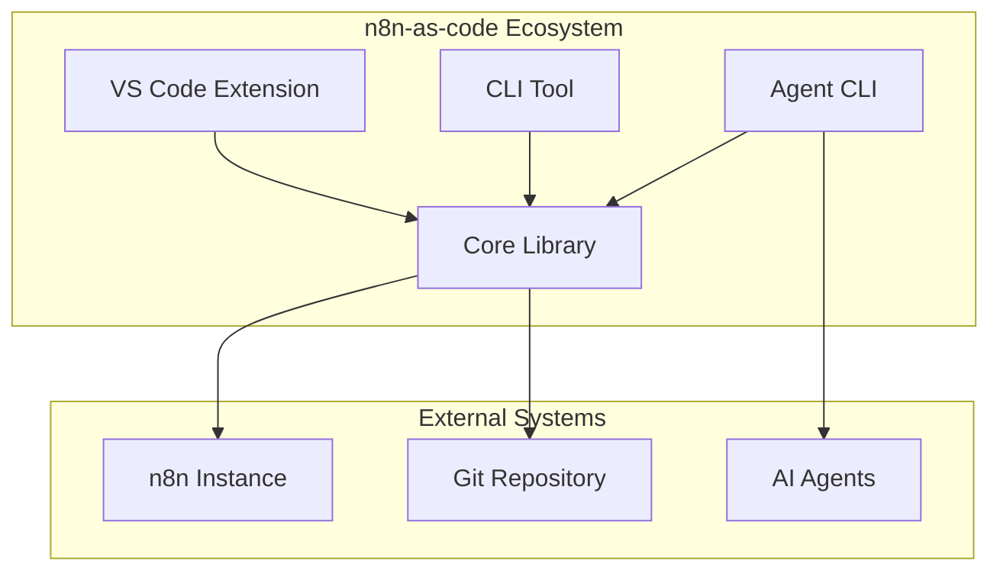

# Documentation Implementation Summary

## Project Overview
Professional documentation solution for n8n-as-code monorepo using **Docusaurus + TypeDoc** with comprehensive architecture diagrams, API documentation, and automated deployment.

## 🎯 Core Objectives Achieved

### 1. **Complete Documentation Structure**
- **Home**: Landing page with overview and features
- **Getting Started**: Installation, configuration, first sync, VS Code setup
- **Usage**: Detailed guides for VS Code Extension, CLI, Agent CLI, and Core Library
- **API Reference**: Auto-generated TypeDoc documentation for all packages
- **Contributors**: Architecture guides, development setup, contribution guidelines
- **Community**: Support, FAQ, troubleshooting, roadmap

### 2. **Technical Architecture**
- **Docusaurus v3**: Modern documentation framework with React
- **TypeDoc**: API documentation generator for TypeScript
- **Monorepo Support**: Cross-package references and coordinated builds
- **Mermaid.js**: Interactive architecture diagrams
- **Algolia Search**: Professional search functionality
- **GitHub Actions CI/CD**: Automated build and deployment

## 📁 Generated Planning Documents

1. **`plans/documentation-structure.md`** - Site architecture and navigation design
2. **`plans/typedoc-configuration.md`** - TypeDoc setup for monorepo packages
3. **`plans/architecture-diagrams.md`** - Visual documentation with Mermaid diagrams
4. **`plans/docusaurus-setup.md`** - Docusaurus project configuration and theming
5. **`plans/typedoc-cross-references.md`** - Cross-package API documentation
6. **`plans/content-outline.md`** - Complete content plan for all sections
7. **`plans/contributor-docs.md`** - Contributor documentation and architecture guides
8. **`plans/search-navigation.md`** - Search functionality and navigation enhancement
9. **`plans/cicd-deployment.md`** - CI/CD pipeline for automated deployment
10. **`plans/testing-deployment.md`** - Comprehensive testing strategy

## 🏗️ Implementation Phases

### Phase 1: Foundation Setup (2-3 weeks)
1. **Week 1**: Docusaurus project setup with custom theming
2. **Week 2**: TypeDoc configuration for monorepo packages
3. **Week 3**: Basic content migration and structure creation

### Phase 2: Content Development (3-4 weeks)
1. **Week 4**: Home and Getting Started sections
2. **Week 5**: Usage guides for all tools
3. **Week 6**: Contributor documentation
4. **Week 7**: API documentation generation and integration

### Phase 3: Enhancement & Polish (2-3 weeks)
1. **Week 8**: Search functionality and navigation improvements
2. **Week 9**: Architecture diagrams and visual documentation
3. **Week 10**: Performance optimization and accessibility

### Phase 4: Deployment & Maintenance (Ongoing)
1. **Week 11**: CI/CD pipeline setup
2. **Week 12**: Testing and quality assurance
3. **Ongoing**: Content updates and maintenance

## 🔧 Technical Implementation Details

### Docusaurus Configuration
- Custom theme with n8n-as-code branding
- Dark/light mode support
- Responsive design for all devices
- SEO optimization
- Analytics integration

### TypeDoc Integration
- Monorepo support with `entryPointStrategy: "packages"`
- Cross-package reference linking
- Custom categorization for each package
- Automated sidebar generation

### Search Implementation
- Primary: Algolia DocSearch (free for OSS)
- Fallback: Local search implementation
- Advanced filtering and faceting
- Mobile-optimized search interface

### Deployment Pipeline
- **GitHub Pages**: Production hosting
- **Vercel**: Preview deployments for PRs
- **GitHub Actions**: Automated CI/CD
- **Monitoring**: Health checks and alerts

## 📊 Success Metrics

### Documentation Quality
- ✅ Complete API documentation for all packages
- ✅ User-friendly navigation structure
- ✅ Visual architecture documentation
- ✅ Search functionality with relevant results
- ✅ Mobile-responsive design
- ✅ Fast build times (< 5 minutes)
- ✅ Easy contribution workflow

### Technical Performance
- Page load time: < 3 seconds
- Lighthouse score: > 90
- Build time: < 5 minutes
- Uptime: 99.9%
- Zero broken links

## 🎨 Visual Documentation Highlights

### Architecture Diagrams


### Data Flow Diagrams
- Workflow synchronization process
- Conflict resolution flow
- API request/response cycles
- State management flow

## 🤝 Contribution Workflow

### For Documentation Contributors
1. Edit Markdown files in `/docs/docs/`
2. Add TSDoc comments to TypeScript code
3. Create PR with changeset
4. Automatic preview deployment
5. Review and merge

### For API Documentation
1. TypeDoc automatically generates from source
2. Cross-package references maintained
3. Regular validation of TSDoc comments
4. Automated build on code changes

## 🚀 Next Steps

### Immediate Actions (Week 1)
1. **Set up Docusaurus project**
   ```bash
   npm run docs:setup
   cd docs
   npm run start
   ```

2. **Configure TypeDoc**
   ```bash
   npm install --save-dev typedoc @typedoc/plugin-cross-package-references
   npm run docs:api
   ```

3. **Create basic structure**
   - Home page
   - Getting Started section
   - Navigation sidebar

### Medium-term (Weeks 2-4)
1. Migrate existing documentation
2. Create usage guides
3. Set up CI/CD pipeline
4. Implement search functionality

### Long-term (Weeks 5-12)
1. Create architecture diagrams
2. Polish UI/UX
3. Performance optimization
4. Accessibility improvements

## 📞 Support and Maintenance

### Regular Maintenance Tasks
- Monthly content reviews
- Quarterly performance audits
- Bi-annual accessibility testing
- Annual architecture review

### Monitoring
- Automated health checks
- Broken link detection
- Performance monitoring
- User feedback collection

### Update Process
1. Documentation updates with code changes
2. Regular TSDoc validation
3. Automated testing on PRs
4. Preview deployments for review

## ✅ Approval Request

This comprehensive plan provides:
1. **Complete technical specification** for Docusaurus + TypeDoc integration
2. **Detailed content strategy** covering all user and contributor needs
3. **Professional deployment pipeline** with CI/CD and monitoring
4. **Visual documentation** with architecture diagrams
5. **Quality assurance** through automated testing

**Ready to switch to Code mode for implementation?** The plan includes all necessary configuration files, scripts, and content outlines to begin building the documentation site immediately.

---

*Note: All planning documents are available in the `/plans` directory with detailed implementation instructions.*