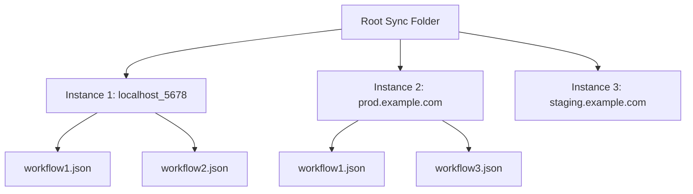
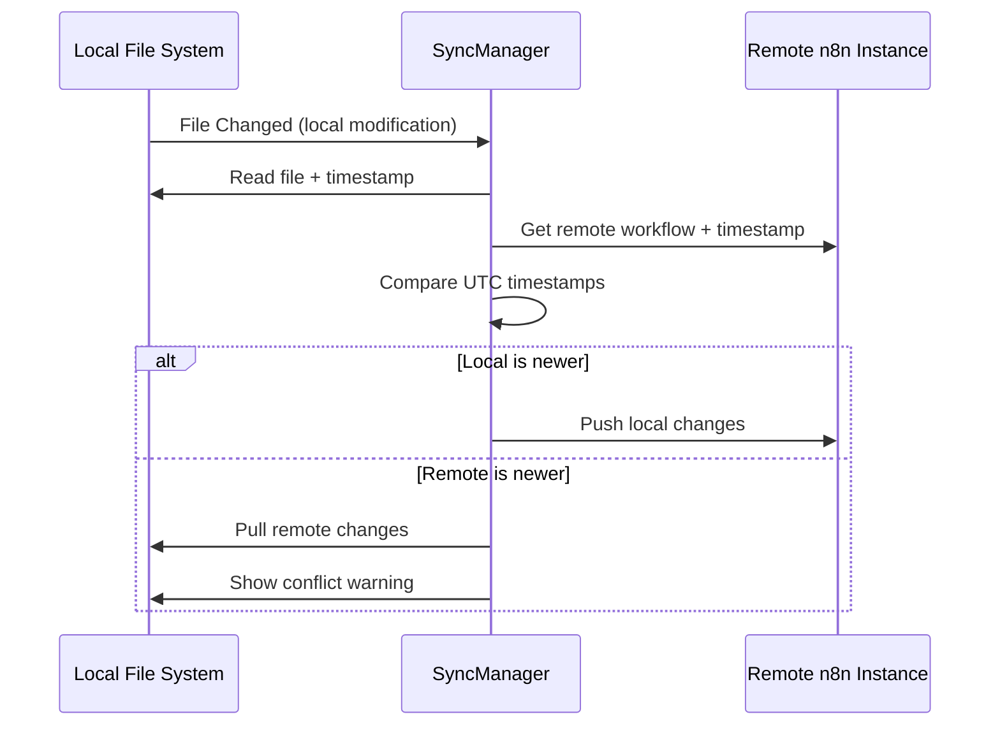

# n8n-as-code Synchronization Improvement Plan

## Current Issues Analysis

### 1. Instance-Specific Directory Problem
**Current behavior**: All workflows are stored in a single directory (`syncFolder`) regardless of which n8n instance they come from.

**Problem**: When switching between different n8n instances without changing the sync folder, workflows from both instances end up in the same directory, causing conflicts and incorrect synchronization.

### 2. Synchronization Conflict Problem
**Current behavior**: The watch system uses polling to check for remote changes and can overwrite local modifications.

**Problem**: Local changes can be lost when the system pulls remote changes that overwrite them, especially during the polling cycle.

### 3. Timestamp Handling Problem
**Current behavior**: No timestamp comparison is implemented to determine which version (local or remote) is newer.

**Problem**: Without proper UTC-based timestamp comparison, the system cannot intelligently resolve conflicts.

## Proposed Architecture

### 1. Instance-Specific Directory Structure



**Implementation**:
- Create subdirectories based on: `host_<hash>` where hash is derived from authentication credentials
- This ensures each unique instance+auth combination has its own directory
- Maintain backward compatibility by allowing migration from old structure

### 2. Enhanced Synchronization Logic



### 3. Timestamp Handling Strategy

**UTC Timestamp Strategy**:
1. Always store and compare timestamps in UTC format
2. Convert local timestamps to UTC before comparison
3. Handle millisecond precision for accurate conflict resolution
4. Use ISO 8601 format for interoperability

## Implementation Details

### Directory Structure Changes

**New directory naming convention**:
```
<syncFolder>/<instance_identifier>/<workflow_files>
```

Where `instance_identifier` = `<host_slug>_<user_slug>`:
- `host_slug`: Cleaned and normalized host URL (e.g., "local_5678", "etiennel_cloud")
- `user_slug`: User-friendly identifier from email or username (e.g., "etienne", "john_doe")

**Host Slug Generation**:
```typescript
function createHostSlug(host: string): string {
    // Remove protocol and trailing slashes
    let cleanHost = host.replace(/^https?:\/\//, '').replace(/\/$/, '');
    
    // Handle localhost with port
    if (cleanHost.startsWith('localhost:')) {
        const port = cleanHost.split(':')[1];
        return `local_${port}`;
    }
    
    // For domains, extract main parts
    // etiennel.app.n8n.cloud -> etiennel_cloud
    // prod.example.com -> prod_example
    cleanHost = cleanHost
        .replace(/\.app\.n8n\.cloud$/, '_cloud')
        .replace(/\.example\.com$/, '_example')
        .replace(/\.com$/, '')
        .replace(/\.io$/, '')
        .replace(/\.net$/, '')
        .replace(/\.org$/, '');
    
    // Replace remaining dots and hyphens with underscores
    return cleanHost
        .replace(/[.-]/g, '_')
        .toLowerCase();
}
```

**User Slug Generation**:
```typescript
function createUserSlug(user: { email?: string; firstName?: string; lastName?: string }): string {
    // Prefer first name + last name initial if available
    if (user.firstName && user.lastName) {
        return `${user.firstName.toLowerCase()}_${user.lastName.charAt(0).toLowerCase()}`;
    }
    
    // Fallback to first name only
    if (user.firstName) {
        return user.firstName.toLowerCase();
    }
    
    // Fallback to email username part
    if (user.email) {
        return user.email.split('@')[0]
            .replace(/[^a-zA-Z0-9]/g, '_')
            .toLowerCase();
    }
    
    // Final fallback
    return 'user';
}
```

**Examples**:
```
// Input: http://localhost:5678/ + user "Etienne Lescot" (etienne@lescot.fr)
// Output: local_5678_etienne_l

// Input: https://etiennel.app.n8n.cloud/ + user "Etienne Lescot" (etienne@lescot.fr)
// Output: etiennel_cloud_etienne_l

// Input: https://prod.example.com/ + user "John Doe" (john.doe@example.com)
// Output: prod_example_john_d
```

**Final Directory Structure**:
```
workflows/local_5678_etienne_l/workflow1.json
workflows/etiennel_cloud_etienne_l/workflow1.json
workflows/prod_example_john_d/workflow1.json
```

### Configuration Changes

**Updated ILocalConfig interface**:
```typescript
interface ILocalConfig {
    host: string;
    syncFolder: string;  // Base directory
    instanceSubfolder?: string;  // Auto-generated: host_authHash
    pollInterval: number;
    syncInactive: boolean;
    ignoredTags: string[];
}
```

### Synchronization Logic Enhancements

**Conflict Resolution Algorithm**:
```typescript
async function resolveConflict(localPath: string, remoteWorkflow: IWorkflow): Promise<'local' | 'remote' | 'manual'> {
    // 1. Get local timestamp (file modification time in UTC)
    const localStats = fs.statSync(localPath);
    const localTimestamp = new Date(localStats.mtime).getTime();
    
    // 2. Get remote timestamp (from workflow metadata)
    const remoteTimestamp = new Date(remoteWorkflow.updatedAt || remoteWorkflow.createdAt || '').getTime();
    
    // 3. Compare timestamps
    if (localTimestamp > remoteTimestamp) {
        return 'local';  // Local is newer
    } else if (remoteTimestamp > localTimestamp) {
        return 'remote'; // Remote is newer
    } else {
        return 'manual'; // Need manual resolution
    }
}
```

### Migration Strategy

**For existing installations**:
1. Detect old flat structure (workflows directly in syncFolder)
2. Prompt user to migrate or keep current structure
3. If migrating:
   - Create instance-specific subdirectory
   - Move existing workflows
   - Update configuration
4. Maintain backward compatibility mode for users who opt out

## Implementation Plan

### Phase 1: Core Infrastructure Changes
1. **Update ConfigService** to generate and store instance identifiers
2. **Update SyncManager** to handle instance-specific directories
3. **Add timestamp utilities** for UTC-based comparison
4. **Implement conflict resolution** logic

### Phase 2: CLI Updates
1. **Update init command** to create instance-specific subdirectories
2. **Update watch command** to use new directory structure
3. **Add migration command** for existing setups

### Phase 3: VSCode Extension Updates
1. **Update extension.ts** to use instance-specific directories
2. **Update configuration handling** in settings
3. **Add migration UI** for existing users

### Phase 4: Testing and Documentation
1. **Unit tests** for timestamp comparison and conflict resolution
2. **Integration tests** for multi-instance scenarios
3. **Update README** with new directory structure
4. **Update documentation** for migration process

## Risk Assessment

### Potential Risks and Mitigations

1. **Data Loss During Migration**: 
   - Mitigation: Implement backup before migration
   - Provide clear warnings and confirmation steps

2. **Breaking Changes for Existing Users**:
   - Mitigation: Maintain backward compatibility mode
   - Provide clear migration path and documentation

3. **Timestamp Accuracy Issues**:
   - Mitigation: Use millisecond precision
   - Handle edge cases with manual resolution fallback

4. **Performance Impact**:
   - Mitigation: Optimize timestamp comparison
   - Cache remote workflow metadata when possible

## Success Criteria

1. ✅ Multiple n8n instances can be used simultaneously without conflicts
2. ✅ Local changes are preserved during synchronization conflicts
3. ✅ UTC-based timestamp comparison resolves conflicts intelligently
4. ✅ Existing users can migrate smoothly to new structure
5. ✅ System remains performant with increased timestamp handling

## Next Steps

The plan is ready for implementation. Would you like me to proceed with the code changes?